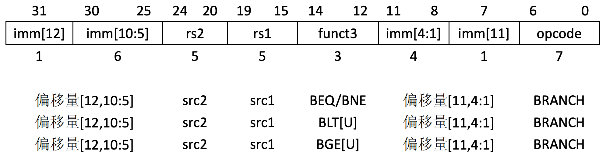

# 1. 条件跳转指令编码格式

所有分支指令使用SB类指令格式。12位B立即数编码了以2字节倍数的有符号偏移量，并被加到当前pc上，生成目标地址。条件分支范围是±4KB。

条件跳转/分支指令编码格式如下

其中，

#### · opcode (7 位，位位置：6-0)：

操作码字段，表示该指令的类型。对于条件跳转指令（如 BEQ、BNE、BLT 等），opcode 字段的值通常是 1100011，表示该指令是一个分支指令。

#### · imm[12] (1 位，位位置：31)：

这个位用于表示偏移量的最高位。它与 imm[10:5] 组合用于计算跳转的偏移量。

#### · imm[10:5] (6 位，位位置：30-25)：

这 6 位与 imm[12] 一起，用于表示跳转的偏移量的一部分。它们的组合决定了跳转地址的中间部分。

#### · rs1 (5 位，位位置：19-15)：

源寄存器 1 字段，表示跳转操作的第一个源寄存器。在大多数条件跳转指令中，rs1 用于存储与条件比较的第一个操作数。

#### · funct3 (3 位，位位置：14-12)：

功能字段，表示跳转操作的具体条件。不同的条件跳转指令有不同的 funct3 值：

000 表示 BEQ（等于），跳转条件为相等。

001 表示 BNE（不等于），跳转条件为不等。

100 表示 BLT（小于），跳转条件为小于。

101 表示 BGE（大于等于），跳转条件为大于等于。

rs2 (5 位，位位置：24-20)：

源寄存器 2 字段，表示跳转操作的第二个源寄存器。在条件跳转中，rs2 用于存储与 rs1 中的值进行比较的操作数。

#### · imm[4:1] (4 位，位位置：11-8)：

这 4 位与 imm[11] 组合一起，表示偏移量的一个部分，补充偏移量的低 4 位。

#### · imm[11] (1 位，位位置：7)：

这是偏移量的倒数第二位，用于补充跳转地址的计算。

条件跳转指令的主要功能是根据两个寄存器中的值进行比较，若满足特定条件，则跳转到指定的目标地址。通过 imm 字段来计算跳转的偏移量，跳转地址是根据当前指令地址和偏移量计算出来的。条件跳转指令（如 BEQ、BNE、BLT、BGE）在实现条件判断、循环等控制流结构时非常有用。

分支指令比较两个寄存器。BEQ和BNE将跳转，如果rs1和rs2相等或者不相等。BLT和BLTU将跳转，如果rs1小于rs2，分别使用有符号数和无符号数进行比较。BGE和BGEU将跳转，如果rs1大于等于rs2，分别使用有符号数和无符号数进行比较。注意，BGT、BGTU、BLE和BLEU可以通过将BLT、BLTU、BGE、BGEU的操作数对调来实现。

软件应当优化，使得顺序代码路径是最常见执行路径，而频率较少的跳转执行代码则放到直线路径之外。软件同时也应当假设向回（向后）跳转总是被预测跳转的，而向前（向下）跳转总是被预测不跳转的，至少第一次碰到分支指令的时候，是这样的。动态分支预测器将很快学会任何可以预测的分支行为。

与其它某些体系结构不同，无条件跳转应当总是使用RISC-V的跳转（rd=x0的JAL）指令，而不是一条条件永远为真的条件分支指令。RISC-V跳转总是pc相对寻址的，并且比分支指令支持大得多的偏移量范围，而且还不会对条件分支预测表造成压力。

# 2. BEQ 

**功能**: `BEQ` (Branch if Equal) 如果寄存器 `rs1` 和 `rs2` 的内容相等，则跳转到目标地址。

**示例**:
```assembly
beq x1, x2, target_label  # 如果 x1 == x2，则跳转到 target_label
```

# 3. BNE 

**功能**: `BNE` (Branch if Not Equal) 如果寄存器 `rs1` 和 `rs2` 的内容不相等，则跳转到目标地址。

**示例**:
```assembly
bne x1, x2, target_label  # 如果 x1 != x2，则跳转到 target_label
```

# 4. BLT 

**功能**: `BLT` (Branch if Less Than, Signed) 如果寄存器 `rs1` 的内容小于寄存器 `rs2` 的内容，则跳转到目标地址，使用有符号比较。

**示例**:
```assembly
blt x1, x2, target_label  # 如果 x1 < x2（有符号比较），则跳转到 target_label
```

# 5. BLTU 

**功能**: `BLTU` (Branch if Less Than, Unsigned) 如果寄存器 `rs1` 的内容小于寄存器 `rs2` 的内容，则跳转到目标地址，使用无符号比较。

**示例**:
```assembly
bltu x1, x2, target_label  # 如果 x1 < x2（无符号比较），则跳转到 target_label
```

# 6. BGE 

**功能**: `BGE` (Branch if Greater Than or Equal, Signed) 如果寄存器 `rs1` 的内容大于或等于寄存器 `rs2` 的内容，则跳转到目标地址，使用有符号比较。

**示例**:
```assembly
bge x1, x2, target_label  # 如果 x1 >= x2（有符号比较），则跳转到 target_label
```

# 7. BGEU 

**功能**: `BGEU` (Branch if Greater Than or Equal, Unsigned) 如果寄存器 `rs1` 的内容大于或等于寄存器 `rs2` 的内容，则跳转到目标地址，使用无符号比较。

**示例**:
```assembly
bgeu x1, x2, target_label  # 如果 x1 >= x2（无符号比较），则跳转到 target_label
```

# 8. BGT

**功能**: `BGT` (Branch if Greater Than, Signed) 如果寄存器 `rs1` 的内容大于寄存器 `rs2` 的内容，则跳转到目标地址，使用带符号比较。

**示例**:
```assembly
bgt x1, x2, target_label  # 如果 x1 > x2（带符号比较），则跳转到 target_label
```

# 9. BGTU 

**功能**: `BGTU` (Branch if Greater Than, Unsigned) 如果寄存器 `rs1` 的内容大于寄存器 `rs2` 的内容，则跳转到目标地址，使用无符号比较。

**示例**:
```assembly
bgtu x1, x2, target_label  # 如果 x1 > x2（无符号比较），则跳转到 target_label
```

# 10. BLE

**功能**: 如果寄存器 `rs1` 的内容小于或等于寄存器 `rs2` 的内容，则跳转到目标地址，使用有符号比较。

**示例**:
```assembly
ble x1, x2, target_label  # 如果 x1 <= x2（有符号比较），则跳转到 target_label
```

# 11. BLEU 

**功能**: `BLEU` (Branch if Less Than or Equal, Unsigned) 如果寄存器 `rs1` 的内容小于或等于寄存器 `rs2` 的内容，则跳转到目标地址，使用无符号比较。

**示例**:
```assembly
bleu x1, x2, target_label  # 如果 x1 <= x2（无符号比较），则跳转到 target_label
```

# 12. 示例

## 12.1 进入示例

[下载测试代码](code/conditional_jump)

下载解压并进入示例目录

## 12.2 编译

```plain
make
```

## 12.3 运行

```plain
make run
```

**运行后LOG如下**
````
make run
qemu-system-riscv64 -nographic -machine virt -m 128M  -bios m_mode.bin  -device loader,file=s_mode.bin,addr=0x80200000  -kernel s_mode.elf
   _____ ____ _____
   / ____|  _ \_   _|
 | (___ | |_) || |
  \ \___ \|  _ < | |
  ____) | |_) || |_
 |_|_____/|____/_____|

Result of risc-v assembly 'beq x1, x2, target_label' is: 1
Result of risc-v assembly 'bne x1, x3, target_label' is: 1
Result of risc-v assembly 'blt x3, x4, target_label' is: 1
Result of risc-v assembly 'bltu x3, x4, target_label' is: 1
Result of risc-v assembly 'bge x4, x3, target_label' is: 1
Result of risc-v assembly 'bgeu x4, x3, target_label' is: 1
Result of risc-v assembly 'bgt x4, x3, target_label' is: 1
Result of risc-v assembly 'bgtu x4, x3, target_label' is: 1
Result of risc-v assembly 'ble x3, x4, target_label' is: 1
Result of risc-v assembly 'bleu x3, x4, target_label' is: 1
````
详见请参考文档：实验环境搭。
