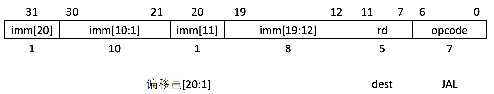
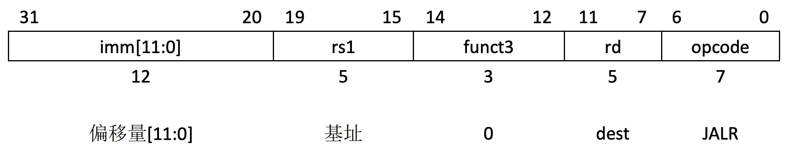

sidebar_position: 7

# 1. 跳转指令编码格式

JAL 和 JALR 指令用于实现跳转并将返回地址保存到寄存器中，常用于函数调用和返回。JAL 是一个无条件跳转指令，而 JALR 则是通过寄存器中的地址进行跳转。

跳转并连接（JAL）指令使用了UJ类格式，此处J立即数编码了一个2的倍数的有符号偏移量。这个偏移量被符号扩展，加到pc上，形成跳转目标地址，跳转范围因此达到±1MB。JAL将跳转指令后面指令的地址（pc+4）保存到寄存器rd中。标准软件调用约定使用x1来作为返回地址寄存器。

普通的无条件跳转指令（汇编语言伪指令J）被编码为rd=x0的JAL指令。

JAL指令编码格式如下

其中，

#### · opcode (7 位，位位置：6-0)：

操作码字段，表示该指令的类型。对于 JAL 指令，opcode 字段的值为 1101111，表示该指令是一个跳转并链接指令。

#### · rd (5 位，位位置：11-7)：

目标寄存器字段，表示返回地址将被存储到寄存器 rd 中。返回地址是下一条指令的地址，即 JAL 指令的下一条指令的地址。

#### · imm[20] (1 位，位位置：31)：

跳转偏移量的最高位，和后面的偏移量部分组合，决定跳转目标的地址。

#### · imm[10:1] (10 位，位位置：30-21)：

偏移量的中间部分，组合 imm[20] 和 imm[11]，用于计算跳转的目标地址。

#### · imm[11] (1 位，位位置：20)：

跳转偏移量的一部分，与 imm[10:1] 组合。

#### · imm[19:12] (8 位，位位置：19-12)：

跳转偏移量的低 8 位。

JAL 指令用于无条件跳转，并将返回地址（即跳转到该指令的地址加 4）保存到目标寄存器 rd 中。它通过计算 imm 字段的偏移量来确定跳转的目标地址。imm 字段的各部分用于拼接成一个 21 位的偏移量，从而计算目标地址。

间接跳转指令JALR（jump and link register）使用I类编码。通过将12位有符号I类立即数加上rs1，然后将结果的最低位设置为0，作为目标地址。跳转指令后面指令的地址（pc+4）保存到寄存器rd中。如果不需要结果，则可以把x0作为目标寄存器。

JALR指令编码格式如下

其中，

#### · opcode (7 位，位位置：6-0)：

操作码字段，表示该指令的类型。对于 JALR 指令，opcode 字段的值为 1100111，表示该指令是一个跳转并链接寄存器指令。

#### · rd (5 位，位位置：11-7)：

目标寄存器字段，表示返回地址将被存储到寄存器 rd 中。返回地址是 JALR 指令的下一条指令的地址。

#### · funct3 (3 位，位位置：14-12)：

功能字段，funct3 字段的值为 000，表示该指令是一个 JALR（跳转并链接寄存器）指令。

#### · rs1 (5 位，位位置：19-15)：

源寄存器字段，表示基地址寄存器，rs1 存储的是跳转地址的基地址。跳转目标地址是通过 rs1 寄存器中的值与 imm[11:0] 偏移量相加得到的。

#### · imm[11:0] (12 位，位位置：31-20)：

偏移量字段，表示跳转目标地址的偏移量。偏移量与 rs1 寄存器中的值相加，得到跳转的最终目标地址。

JALR 指令通过寄存器中的值和偏移量计算跳转目标地址。该指令首先将返回地址（即下一条指令的地址）保存到寄存器 rd 中，然后跳转到 rs1 + imm[11:0] 计算出的地址。

# 2. JAL 

**功能**: `JAL` (Jump and Link) 跳转到目标地址，并将返回地址存储到寄存器中。目标地址通过将一个带符号的21位立即数（以2字节为单位编码）加到当前程序计数器（PC）上来计算。跳转后指令的地址（PC + 4）存储在目标寄存器（rd）中。

**示例**:
```assembly
jal x1, target_label  # 跳转到目标地址 (target_label)，并将返回地址存储到 x1
```

# 3. JALR 

**功能**: `JALR` (Jump and Link Register) 跳转到一个通过寄存器（rs1）中的值和一个带符号的12位立即数（I-立即数）计算出的地址。目标地址通过将rs1的内容与立即数相加，然后将结果的最低有效位（LSB）设置为零（使跳转目标对齐到2字节边界）来计算。跳转后指令的地址（PC + 4）存储在目标寄存器（rd）中。

**示例**:
```assembly
jalr x1, 0(x5)  # 跳转到 x5 + 0 处的地址，并将返回地址存储到 x1
```

# 4. 示例

## 4.1 进入示例

[下载测试代码](code/jump)

下载解压并进入示例目录

## 4.2 编译

```plain
make
```

## 4.3 运行

```plain
make run
```

**运行后LOG如下**
````
make run
qemu-system-riscv64 -nographic -machine virt -m 128M  -bios m_mode.bin  -device loader,file=s_mode.bin,addr=0x80200000  -kernel s_mode.elf
   _____ ____ _____
   / ____|  _ \_   _|
 | (___ | |_) || |
  \ \___ \|  _ < | |
  ____) | |_) || |_
 |_|_____/|____/_____|

Result of risc-v assembly 'jal x1, target_label' is: 1
Result of risc-v assembly 'jalr x1, 0(x5)' is: 1
````

详见请参考文档：实验环境搭。
