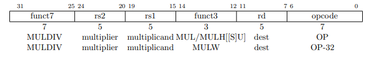
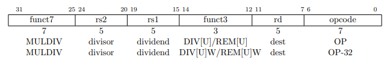
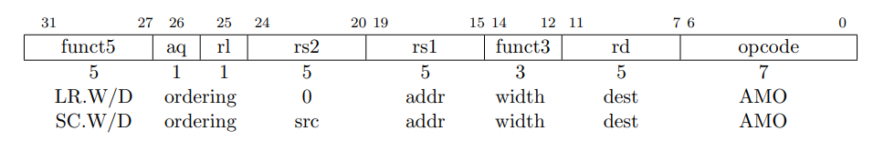
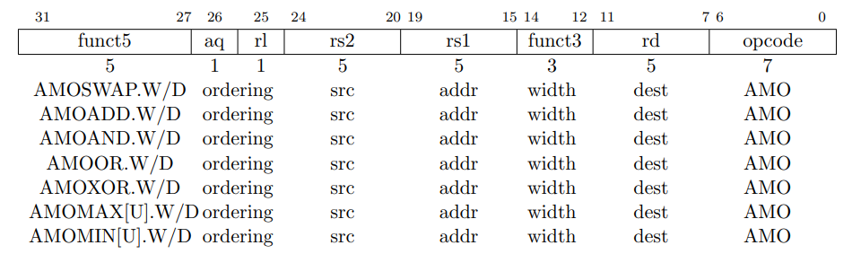
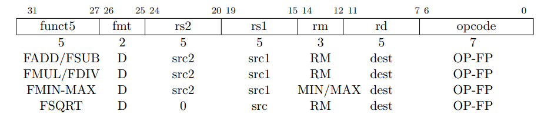
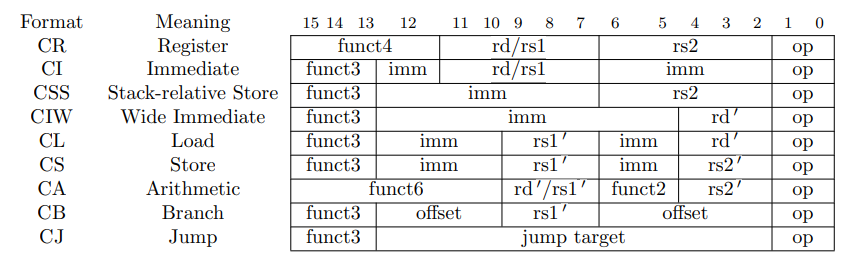
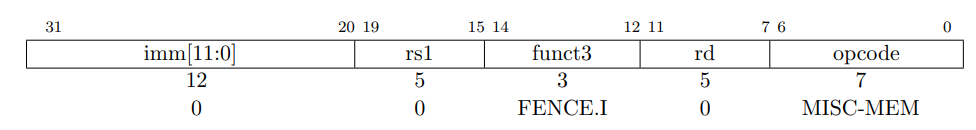

sidebar_position: 9

# 扩展指令集

RISC-V 的设计具有模块化和可扩展性。在基本指令集（RV32I 或 RV64I）的基础上，RISC-V 定义了一系列扩展指令集，满足不同领域和应用场景的需求。这些扩展指令集通过附加功能来增强性能、提高效率或支持特定功能。

以下是 RISC-V 的主要扩展指令集及其功能简介。

## 1. M 扩展（整数乘除扩展）

### 1.1 功能

M 扩展增加了整数的乘法和除法操作，适用于需要大量算术运算的应用。

### 1.2 乘法指令

| 指令       | 功能说明               | 示例              |
|------------|------------------------|-------------------|
| mul        | 无符号整数乘法         | mul x3, x1, x2  |
| mulh       | 高位乘积（有符号乘法） | mulh x3, x1, x2|
| mulhu      | 高位乘积（无符号乘法） | mulhu x3, x1, x2|
| mulhsu     | 高位乘积（有符号*无符号乘法） | mulshu x3, x1, x2|
| mulw       | 低位乘积              | mulw x3, x1, x2|

#### 1.2.1 乘法指令格式



#### 1.2.2 字段说明

| 位宽   | 字段      | 描述                           |
|--------|-----------|--------------------------------|
| 7      | funct7    | 用于指令功能标识               |
| 5      | rs2       | 第二操作数（乘数/因子）        |
| 5      | rs1       | 第一操作数（被乘数/因子）      |
| 3      | funct3    | 功能选择（区分具体操作）       |
| 5      | rd        | 目标寄存器（存放结果）         |
| 7      | opcode    | 操作码，表示这是乘除法操作指令 |

#### 1.2.3 示例

```
MUL a0, a1, a2    # a0 = a1 * a2 (低 XLEN 位结果)
MULH a0, a1, a2   # a0 = 高 XLEN 位的有符号乘法结果
MULHSU a0, a1, a2 # a0 = 高 XLEN 位的混合符号乘法结果
MULW a0, a1, a2   # a0 = 32 位乘法结果，符号扩展至 64 位
```

### 1.3 除法指令

| 指令       | 功能说明               | 示例              |
|------------|------------------------|-------------------|
| div        | 有符号整数除法         | div x3, x1, x2  |
| divu       | 无符号整数除法         | divu x3, x1, x2 |
| rem        | 有符号整数取余         | rem x3, x1, x2  |
| remu       | 无符号整数取余         | remu x3, x1, x2 |
| divw/remw       | RV64指令，仅对低 32 位操作，结果符号扩展至 64 位 | divw/remw x3, x1, x2 |

#### 1.3.1 除法指令格式



#### 1.3.2 字段说明

| 位宽   | 字段      | 描述                           |
|--------|-----------|--------------------------------|
| 7      | funct7    | 用于指令功能标识               |
| 5      | rs2       | 第二操作数（除数）            |
| 5      | rs1       | 第一操作数（被除数）          |
| 3      | funct3    | 功能选择（区分具体操作）       |
| 5      | rd        | 目标寄存器（存放结果）         |
| 7      | opcode    | 操作码，表示这是乘除法操作指令 |

#### 1.3.3 示例

```
DIV a0, a1, a2    # a0 = a1 / a2（商）
REM a0, a1, a2    # a0 = a1 % a2（余数）
DIVU a0, a1, a2   # a0 = 无符号(a1 / a2) 的商
REMU a0, a1, a2   # a0 = 无符号(a1 % a2) 的余数
DIVW a0, a1, a2   # a0 = 低 32 位 a1 / a2 的商，符号扩展至 64 位
REMW a0, a1, a2   # a0 = 低 32 位 a1 % a2 的余数，符号扩展至 64 位
```

## 2. A 扩展（原子操作扩展）

### 2.1 功能

标准的原子指令扩展（简称“A”）包含可以原子性地对内存进行读-改-写操作的指令，用于支持在共享内存空间中多个RISC-V硬件线程（hart）之间的同步。这些原子指令分为两种形式：保留加载/条件存储（Load-Reserved/Store-Conditional，LR/SC）指令和原子性取值并操作内存（Atomic Fetch-and-Op Memory）指令。这两种指令形式均支持包括无序、获取（Acquire）、释放（Release）和顺序一致（Sequentially Consistent）语义在内的多种内存一致性顺序。通过这些指令，RISC-V能够支持RCsc（Release Consistency with Sequential Consistency）内存一致性模型。

### 2.2 LR/SC指令

| 指令       | 功能说明               | 示例              |
|------------|------------------------|-------------------|
| lr.w       | 加载并保留（Load Reserved） | lr.w x3, (x1)   |
| sc.w       | 条件存储（Store Conditional） | sc.w x3, x2, (x1) |

#### 2.2.1 指令格式



#### 2.2.2 字段说明

| 位段范围    | 字段名     | 位宽 | 描述             |
| ----------- | ---------- | ---- | ---------------- |
| 31          | funct5   | 5    | 功能编码         |
| 27          | aq       | 1    | 获取顺序约束位   |
| 26          | rl       | 1    | 释放顺序约束位   |
| 25-24       | rs2      | 5    | 源寄存器2        |
| 20-19       | rs1      | 5    | 源寄存器1（地址）|
| 15-14       | funct3   | 3    | 功能编码         |
| 12-11       | rd       | 5    | 目标寄存器       |
| 7-6         | opcode   | 7    | 操作码           |

#### 2.2.3 示例

这段代码实现了一个简单的 CAS 操作，通过 LR/SC 指令确保原子操作的正确性和内存一致性。

```
cas:
    lr.w t0, (a0)        # 加载原始值到 t0。
    bne t0, a1, fail     # 如果 t0 不等于 a1，则跳转到失败处理。
    sc.w t0, a2, (a0)    # 尝试更新为 a2 的值。
    bnez t0, cas         # 如果 store-conditional 失败，重试。
    li a0, 0             # 设置返回值为成功。
    jr ra                # 返回。

fail:
    li a0, 1             # 设置返回值为失败。
    jr ra                # 返回。
```

### 2.3 AMO指令

| 指令          | 功能说明                            | 示例                  |
|---------------|-------------------------------------|-----------------------|
| **AMOSWAP.W/D** | 交换操作，指定源、地址、宽度和目标   | amoswap.w t0, t1, (a0) |
| **AMOADD.W/D** | 加法操作，指定源、地址、宽度和目标   | amoadd.w t0, t1, (a0) |
| **AMOAND.W/D** | 按位与操作，指定源、地址、宽度和目标 | amoand.w t0, t1, (a0) |
| **AMOOR.W/D**  | 按位或操作，指定源、地址、宽度和目标 | amoer.w t0, t1, (a0)  |
| **AMOXOR.W/D** | 按位异或操作，指定源、地址、宽度和目标 | amoxor.w t0, t1, (a0) |
| **AMOMAX[U].W/D** | 最大值操作，指定源、地址、宽度和目标 | amomax.w t0, t1, (a0) |
| **AMOMIN[U].W/D** | 最小值操作，指定源、地址、宽度和目标 | amomin.w t0, t1, (a0) |

#### 2.3.1 指令格式



#### 2.3.2 字段说明

| 位宽 | 字段    | 描述                           |
|------|---------|--------------------------------|
| 5    | funct5  | 用于指令功能标识               |
| 1    | aq      | 获取操作位 (Acquire)           |
| 1    | rl      | 释放操作位 (Release)           |
| 5    | rs2     | 第二个操作数 (操作数2)           |
| 5    | rs1     | 第一个操作数 (操作数1)         |
| 3    | funct3  | 功能选择 (区分具体操作)        |
| 5    | rd      | 目标寄存器 (存放结果)          |
| 7    | opcode  | 操作码，表示这是AMO操作指令   |

#### 2.3.3 示例

以下是受测试和测试设置自旋锁保护的临界区的示例代码。

```
li t0, 1                # 初始化交换值
again:
lw t1, (a0)             # 检查锁是否被持有
bnez t1, again           # 如果锁被持有则重试
amoswap.w.aq t1, t0, (a0) # 尝试获取锁
bnez t1, again           # 如果锁被持有则重试
# ...
# 临界区代码
# ...
amoswap.w.rl x0, x0, (a0) # 通过存储0释放锁
```

## 3. F 扩展（单精度浮点扩展）

### 3.1 功能

F 扩展为 RISC-V 添加了支持 IEEE 754 单精度浮点格式的指令。F 扩展指令集可以进行单精度浮点加法、减法、乘法、除法、比较以及其他常见的浮点运算，提供了处理浮点数的能力。这些指令使得 RISC-V 可以进行更高效的浮点计算，特别是在嵌入式系统、数字信号处理和图形计算等领域。

### 3.2 浮点运算指令

| 指令        | 功能说明                       | 示例                     |
|-------------|--------------------------------|--------------------------|
| **FADD.S**  | 单精度浮点加法                 | fadd.s f0, f1, f2     |
| **FSUB.S**  | 单精度浮点减法                 | fsub.s f0, f1, f2      |
| **FMUL.S**  | 单精度浮点乘法                 | fmul.s f0, f1, f2      |
| **FDIV.S**  | 单精度浮点除法                 | fdiv.s f0, f1, f2      |
| **FMADD.S** | 单精度浮点乘加（fused multiply-add） | fmadd.s f0, f1, f2, f3 |
| **FMSUB.S** | 单精度浮点乘减（fused multiply-subtract） | fmsub.s f0, f1, f2, f3 |
| **FSGNJ.S** | 单精度浮点设置符号             | fsgnj.s f0, f1, f2     |
| **FSQRT.S** | 单精度浮点平方根               | fsqrt.s f0, f1         |
| **FCVT.W.S** | 单精度浮点转整数（向下取整）    | fcvt.w.s x1, f0        |

### 3.2.1 指令格式

F 扩展指令的格式通常为 R-type 或 I-type 格式。具体格式如下：

**R-type格式**（例如：FADD.S, FMUL.S）

| opcode | rd   | funct3 | rs1  | rs2  | funct7 |
|--------|------|--------|------|------|--------|
| 7 bits | 5 bits | 3 bits | 5 bits | 5 bits | 7 bits |

- **opcode**：操作码，指定指令类型。
- **rd**：目标寄存器，存储运算结果。
- **funct3**：功能选择位，指定具体的操作类型（如加法、减法等）。
- **rs1**：源寄存器 1，参与运算的第一个操作数。
- **rs2**：源寄存器 2，参与运算的第二个操作数。
- **funct7**：功能编码，指定具体指令的操作类型（如浮点加法、浮点乘法等）。

**I-type格式**（例如：FCVT.W.S）

| opcode | rd   | funct3 | rs1  | imm   |
|--------|------|--------|------|-------|
| 7 bits | 5 bits | 3 bits | 5 bits | 12 bits |

- **opcode**：操作码，指定指令类型。
- **rd**：目标寄存器，存储运算结果。
- **funct3**：功能选择位，指定具体操作。
- **rs1**：源寄存器 1，参与运算的操作数。
- **imm**：立即数，指定常数值（如转换为整数时的位移量）。

这些指令格式通过不同的opcode和funct3字段，能够指定不同的浮点运算和浮点数转换操作。

#### 3.2.2 示例

- **FADD.S（单精度浮点加法）**

该指令将两个单精度浮点数相加，并将结果存储在目标寄存器中。

```
fadd.s f0, f1, f2    # f0 = f1 + f2
```

- **FSUB.S（单精度浮点减法）**

该指令执行浮点减法操作，将 f1 中的单精度浮点数减去 f2 中的浮点数，并将结果存储到 f3 中。

```
fsub.s f3, f1, f2   # f3 = f1 - f2
```

- **FMUL.S（单精度浮点乘法）**

该指令执行浮点乘法操作，将 f1 和 f2 中的单精度浮点数相乘，并将结果存储到 f3 中。

```
fmul.s f3, f1, f2   # f3 = f1 * f2
```

- **FDIV.S（单精度浮点除法）**

该指令执行浮点除法操作，将 f1 中的单精度浮点数除以 f2 中的浮点数，并将结果存储到 f3 中。

```
fdiv.s f3, f1, f2   # f3 = f1 / f2
```

- **FDIV.S（单精度浮点比较）**

这些指令执行单精度浮点比较操作，分别比较 f1 和 f2 的相等性、小于关系以及小于等于关系，结果存储在 t0 中。

```
feq.s t0, f1, f2    # 如果 f1 == f2，t0 = 1，否则 t0 = 0
flt.s t0, f1, f2    # 如果 f1 < f2，t0 = 1，否则 t0 = 0
fle.s t0, f1, f2    # 如果 f1 <= f2，t0 = 1，否则 t0 = 0
```

- **FDIV.S（单精度浮点转换）**

这些指令执行浮点与整数之间的转换，将 t0 中的整数转换为单精度浮点数，并将 f1 中的单精度浮点数转换为整数。

```
fcvt.s.w f1, t0     # 将整数 t0 转换为单精度浮点数，结果存储到 f1
fcvt.w.s t0, f1     # 将单精度浮点数 f1 转换为整数，结果存储到 t0
```

- **FDIV.S（单精度浮点加载和存储）**

这些指令执行浮点数的加载和存储操作，分别将内存中的单精度浮点数加载到寄存器 f1 中，或者将寄存器 f1 中的单精度浮点数存储到内存中。

```
flw f1, 0(a0)       # 从内存地址 a0 处加载单精度浮点数到 f1
fsw f1, 0(a0)       # 将 f1 中的单精度浮点数存储到内存地址 a0 处
```

- **FDIV.S（单精度浮点绝对值操作）**

该指令执行浮点数的绝对值操作，将 f1 中的单精度浮点数的绝对值存储到 f3 中。

```
fabs.s f3, f1       # f3 = |f1|
```

- **FDIV.S（单精度浮点其他操作）**

这些指令执行常见的浮点操作，如平方根、符号调整、最小值和最大值操作。

```
fsqrt.s f3, f1      # f3 = √f1
fsgnj.s f3, f1, f2  # f3 = f1 的符号与 f2 相同的浮点数
fmin.s f3, f1, f2   # f3 = f1 和 f2 中的较小值
fmax.s f3, f1, f2   # f3 = f1 和 f2 中的较大值
```
  
## 4. D 扩展（双精度浮点扩展）

### 4.1. 功能

标准的双精度浮点指令集扩展，称为 “D”，该扩展增加了符合 IEEE 754-2008 算术标准的双精度浮点计算指令。D 扩展依赖于基础的单精度指令子集 F。

### 4.2 指令

| 指令       | 功能说明               | 示例              |
|------------|------------------------|-------------------|
| fld        | 浮点数加载             | fld f1, 0(x1)   |
| fsd        | 浮点数存储             | fsd f1, 0(x1)  |
| fadd.d     | 双精度浮点加法         | fadd.d f1, f2, f3 |
| fsub.d     | 双精度浮点减法         | fsub.d f1, f2, f3 |
| fmul.d     | 双精度浮点乘法         | fmul.d f1, f2, f3 |
| fdiv.d     | 双精度浮点除法         | fdiv.d f1, f2, f3 |

#### 4.2.1 指令格式



#### 4.2.2 字段说明

| 字段      | 说明                                                         |
|-----------|--------------------------------------------------------------|
| funct5    | 指令功能码，用于指定指令的具体操作类型。对于不同的指令，funct5字段的值会有所不同，以区分不同的运算或操作。 |
| fmt       | 数据格式字段，指示操作数的浮点数格式。该字段用于指定源和目标寄存器中存储的浮点数的精度（如单精度、双精度等）。 |
| rs2       | 第二个源寄存器，参与运算的浮点寄存器。该字段指向需要与rs1操作的第二个浮点数值寄存器。 |
| rs1       | 第一个源寄存器，参与运算的浮点寄存器。该字段指向进行计算或存储操作的第一个浮点数值寄存器。 |
| rm        | 舍入模式字段，指定在进行浮点数运算时采用的舍入模式。它决定了在结果无法精确表示时应如何处理。 |
| rd        | 目标寄存器，存储操作结果的寄存器。该字段指定计算结果将被写入哪个浮点寄存器。 |
| opcode    | 操作码字段，标识指令的类型和类别。它用于指示该指令是执行何种类型的操作（如加载、存储、算术运算等）。 |

#### 4.2.3 示例

- **加载双精度浮点数**

```
fld f1, 0(x1)  # 从内存地址 x1 加载双精度浮点数到寄存器 f1
```

- **存储双精度浮点数**

```
fsd f1, 0(x1)  # 将寄存器 f1 中的双精度浮点数存储到内存地址 x1
```

- **双精度浮点加法**

```
fadd.d f1, f2, f3  # 计算 f2 + f3，将结果存储到 f1
```

- **双精度浮点减法**

```
fsub.d f1, f2, f3  # 计算 f2 - f3，将结果存储到 f1
```

- **双精度浮点乘法**

```
fmul.d f1, f2, f3  # 计算 f2 * f3，将结果存储到 f1
```

- **双精度浮点除法**

```
fdiv.d f1, f2, f3  # 计算 f2 / f3，将结果存储到 f1
```

## 5. C 扩展（压缩指令集）

### 5.1 功能

本章描述了当前的RISC-V标准压缩指令集扩展提案，称为C，它通过为常见操作添加短16位指令编码来减少静态和动态代码大小。C扩展可以添加到任何基本ISA（RV32，RV64，RV128），我们使用通用术语RVC来涵盖这些。通常，程序中的50%-60%的RISC-V指令可以被RVC指令替代，从而减少25%-30%的代码大小。压缩指令的格式通常为16位，具体格式取决于指令类型。不同的指令类型将有不同的字段布局，用于编码操作码、寄存器编号和立即数等。

### 5.2 指令

| 指令       | 功能说明               | 示例              |
|------------|------------------------|-------------------|
| c.addi     | 压缩版立即数加法       | c.addi x1, 10    |
| c.lw       | 压缩版加载字           | c.lw x1, 0(x2)   |
| c.sw       | 压缩版存储字           | c.sw x1, 0(x2)   |
| c.j        | 压缩版跳转             | c.j Label         |
| c.beqz     | 压缩版等于零分支跳转   | c.beqz x1, Label  |
| c.bnez     | 压缩版不等于零分支跳转 | c.bnez x1, Label  |
| c.jal      | 压缩版跳转并链接       | c.jal x1, Label   |
| c.add      | 压缩版加法             | c.add x1, x2, x3  |
| c.sub      | 压缩版减法             | c.sub x1, x2, x3  |
| c.and      | 压缩版与操作           | c.and x1, x2, x3  |
| c.or       | 压缩版或操作           | c.or x1, x2, x3   |
| c.xor      | 压缩版异或操作         | c.xor x1, x2, x3  |
| c.slli     | 压缩版左移立即数       | c.slli x1, x2, 2  |
| c.srli     | 压缩版右移立即数       | c.srli x1, x2, 2  |
| c.srai     | 压缩版算术右移立即数   | c.srai x1, x2, 2  |

#### 5.2.1 指令格式



#### 5.2.2 字段说明

| 字段名称            | 说明                                         |
|---------------------|----------------------------------------------|
| funct4              | CR 格式指令的功能字段，4 位                |
| funct3              | CI、CSS、CIW、CL、CS、CA、CB、CJ 格式指令的功能字段，3 位 |
| funct6              | CA 格式指令的功能字段，6 位                |
| funct2              | CA 格式指令的附加功能字段，2 位            |
| rd/rs1              | 目标寄存器（rd）或源寄存器（rs1）          |
| rs2                 | 额外的源寄存器（rs2）                       |
| imm                 | 立即数字段                                  |
| offset              | 分支指令的偏移量                           |
| jump target         | 跳转指令的目标地址                         |
| op                  | 操作码字段  

#### 5.2.3 示例

以下是一些压缩指令的示例及其功能说明：

- **c.addi x1, 10**

  ```
  c.addi x1, 10  # 将立即数 10 加入寄存器 x1
  ```

- **c.lw x1, 0(x2)**

  ```
  c.lw x1, 0(x2)  # 从地址 x2 加 0 加载字到寄存器 x1
  ```

- **c.sw x1, 0(x2)**

  ```
  c.sw x1, 0(x2)  # 将寄存器 x1 的值存储到地址 x2 加 0 的位置
  ```

- **c.j Label**

  ```
  c.j Label  # 跳转到标签 Label
  ```

- **c.beqz x1, Label**

  ```
  c.beqz x1, Label  # 如果寄存器 x1 为 0，则跳转到 Label
  ```

- **c.bnez x1, Label**

  ```
  c.bnez x1, Label  # 如果寄存器 x1 不为 0，则跳转到 Label
  ```

- **c.jal x1, Label**

  ```
  c.jal x1, Label  # 跳转到 Label，并将返回地址保存到 x1
  ```

- **c.add x1, x2, x3**

  ```
  c.add x1, x2, x3  # 将寄存器 x2 和 x3 的值相加，结果存储到 x1
  ```

- **c.sub x1, x2, x3**

  ```
  c.sub x1, x2, x3  # 从 x2 中减去 x3 的值，结果存储到 x1
  ```

- **c.and x1, x2, x3**

  ```
  c.and x1, x2, x3  # 将寄存器 x2 和 x3 进行按位与，结果存储到 x1
  ```

- **c.or x1, x2, x3**

  ```
  c.or x1, x2, x3  # 将寄存器 x2 和 x3 进行按位或，结果存储到 x1
  ```

- **c.xor x1, x2, x3**

  ```
  c.xor x1, x2, x3  # 将寄存器 x2 和 x3 进行按位异或，结果存储到 x1
  ```

- **c.slli x1, x2, 2**

  ```
  c.slli x1, x2, 2  # 将寄存器 x2 左移 2 位，结果存储到 x1
  ```

- **c.srli x1, x2, 2**

  ```
  c.srli x1, x2, 2  # 将寄存器 x2 右移 2 位，结果存储到 x1
  ```

- **c.srai x1, x2, 2**

  ```
  c.srai x1, x2, 2  # 将寄存器 x2 算术右移 2 位，结果存储到 x1
  ```

## 6. Zicsr 和 Zifencei 扩展（控制状态寄存器与指令屏障）

### 6.1 功能

Zicsr：提供对控制状态寄存器（CSR）的读写操作，允许程序访问和修改与特权状态和控制相关的寄存器。
Zifencei：用于处理指令流中的顺序一致性，确保写入指令内存的操作在后续指令获取之前可见。

### 6.2 指令

| 指令       | 功能说明               | 示例              |
|------------|------------------------|-------------------|
| csrrw      | 读写 CSR 寄存器        | csrrw x1, csr, x2 |
| csrrs      | 读并设置 CSR 位        | csrrs x1, csr, x2 |
| csrrc      | 读并清除 CSR 位        | csrrc x1, csr, x2 |
| csrrwi     | 使用立即数写入 CSR     | csrrwi x1, csr, 5 |
| csrsi      | 使用立即数设置 CSR 位  | csrsi x1, csr, 5 |
| csrci      | 使用立即数清除 CSR 位  | csrci x1, csr, 5 |
| fence.i    | 指令流同步屏障         | fence.i           |

#### 6.2.1 指令格式



#### 6.2.2 字段说明

| 字段名称 | 说明                                         |
|----------|----------------------------------------------|
| csr      | 指定要操作的控制状态寄存器的地址           |
| rs1      | 源寄存器，用于提供值或立即数                 |
| funct3   | 指令的功能类型（如读、写、设置、清除等）   |
| rd       | 存储读取到的 CSR 值的目标寄存器             |
| opcode    | 指令操作码，用于区分不同的操作类型         |

#### 6.2.3 示例

- **csrrw 示例**

```
csrrw x1, 0x300, x2  # 将 CSR 地址为 0x300 的值读入 x1，同时将 x2 的值写入 CSR
```  

- **csrrs 示例**

```
csrrs x1, 0x300, x2  # 将 CSR 地址为 0x300 的值读入 x1，并将 x2 中的位设置到 CSR
```

- **fence.i 示例**

```
fence.i              # 确保之前的存储操作对指令获取可见
```

## 7. 示例

### 7.1 进入示例

[下载测试代码](code/extensioninstruction)

下载解压并进入示例目录

### 7.2 编译

```
make
```

## 7.3 运行

```
make run
```

**运行后LOG如下**

```
qemu-system-riscv64 -nographic -machine virt -m 128M  -bios m_mode.bin  -device loader,file=s_mode.bin,addr=0x80200000  -kernel s_mode.elf
   _____ ____ _____
   / ____|  _ \_   _|
 | (___ | |_) || |
  \ \___ \|  _ < | |
  ____) | |_) || |_
 |_|_____/|____/_____|

Result of risc-v assembly 'mul x1, x2, x3' is: 15
Result of risc-v assembly 'mulh x1, x2, x3' is: -1
Result of risc-v assembly 'mulhsu x1, x2, x3' is: 1
Result of risc-v assembly 'mulw x1, x2, x3' is: 116650
Result of risc-v assembly 'div x1, x2, x3' is: 655
Result of risc-v assembly 'divu x1, x2, x3' is: 655
Result of risc-v assembly 'rem x1, x2, x3' is: 35
Result of risc-v assembly 'remu x1, x2, x3' is: 35
Result of LR operation: 0
Result of SC operation: 1 (new value: 0)
Result of AMOSWAP operation: 0 (new value: 100)
Result of AMOADD operation: 100 (new value: 110)
Result of risc-v assembly 'fadd.s x1, x2, x3' is: 4.70
Result of risc-v assembly 'fsub.s x1, x2, x3' is: 2.30
Result of risc-v assembly 'fmul.s x1, x2, x3' is: 4.20
Result of risc-v assembly 'fdiv.s x1, x2, x3' is: 2.92
Result of risc-v assembly 'fadd.d x1, x2, x3' is: 4.70
Result of risc-v assembly 'fsub.d x1, x2, x3' is: 2.30
Result of risc-v assembly 'fmul.d x1, x2, x3' is: 4.20
Result of risc-v assembly 'fdiv.d x1, x2, x3' is: 2.92
```

详见请参考文档：实验环境搭建。
