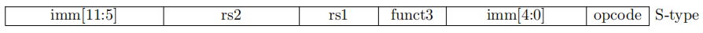
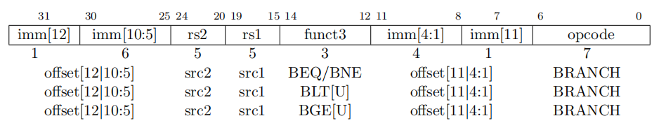
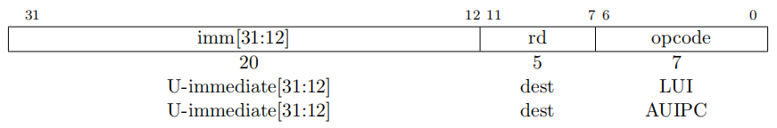

sidebar_position: 10

# 指令编码方式

RISC-V 指令集的设计遵循简洁和高效的原则，指令长度为32或64位，并采用了清晰、模块化的编码方式。RISC-V 的指令格式可以分为六种主要类型，每种类型有其独特的编码方式。本文将介绍这些指令格式的详细编码方式。

# 1. R 型指令编码

## 1.1 功能
R 型指令用于寄存器-寄存器操作，主要用于加法、减法、逻辑运算、移位操作等。

## 1.2 字段说明

| 字段     | 位宽 | 描述                      |
|----------|------|---------------------------|
| opcode   | 7 位 | 操作码，指示操作类型       |
| rd       | 5 位 | 目标寄存器（目的寄存器）   |
| funct3   | 3 位 | 功能字段，用于区分不同操作 |
| rs1      | 5 位 | 源寄存器 1                |
| rs2      | 5 位 | 源寄存器 2                |
| funct7   | 7 位 | 进一步细化操作            |

## 1.3 示例

| 指令 | 操作     | 编码示例                      |
|------|----------|-------------------------------|
| add  | 加法     |  0000000 00001 00010 000 00011 0110011  |
| sub  | 减法     |  0100000 00001 00010 000 00011 0110011  |
| sll  | 左移     |  0000000 00001 00010 001 00011 0110011  |

# 2. I 型指令编码

## 2.1 功能
I 型指令用于处理立即数（短立即数和负载操作），如加法、移位、加载等。

## 2.2 字段说明

| 字段     | 位宽 | 描述                      |
|----------|------|---------------------------|
| opcode   | 7 位 | 操作码，指示操作类型       |
| rd       | 5 位 | 目标寄存器（目的寄存器）   |
| funct3   | 3 位 | 功能字段，用于区分不同操作 |
| rs1      | 5 位 | 源寄存器 1                |
| imm      | 12 位| 立即数（符号扩展为 12 位）|

## 2.3 示例

| 指令  | 操作             | 编码示例                      |
|-------|------------------|-------------------------------|
| addi  | 加法（立即数加法）|  000000000010 00001 000 00011 0010011  |
| lw    | 加载字           |  000000000000 00001 010 00011 0000011  |
| slti  | 小于立即数比较   |  000000000010 00001 010 00011 0010011  |

# 3. S 型指令编码

## 3.1 功能
S 型指令用于存储操作，将寄存器中的数据存储到内存中。

## 3.2 字段说明

| 字段       | 位宽 | 描述                      |
|------------|------|---------------------------|
| opcode     | 7 位 | 操作码，指示操作类型       |
| imm[4:0]   | 5 位 | 立即数的低 5 位           |
| funct3     | 3 位 | 功能字段，用于区分不同操作 |
| rs1        | 5 位 | 源寄存器 1                |
| rs2        | 5 位 | 源寄存器 2                |
| imm[11:5]  | 7 位 | 立即数的高 7 位           |

## 3.3 示例

| 指令 | 操作                 | 编码示例                      |
|------|----------------------|-------------------------------|
| sw   | 存储字（存入内存）  |  000000000000 00001 010 00011 0100011  |
| sh   | 存储半字（存入内存）|  000000000000 00001 001 00011 0100011  |
| sb   | 存储字节（存入内存）|  000000000000 00001 000 00011 0100011  |

# 4. B 型指令编码

## 4.1 功能
B 型指令用于条件跳转指令，如beq、bne等。

## 4.2 字段说明

| 字段       | 位宽 | 描述                      |
|------------|------|---------------------------|
| opcode     | 7 位 | 操作码，指示操作类型       |
| imm[4:1]   | 4 位 | 立即数的低 4 位           |
| funct3     | 3 位 | 功能字段，用于区分不同操作 |
| rs1        | 5 位 | 源寄存器 1                |
| rs2        | 5 位 | 源寄存器 2                |
| imm[11:5]  | 7 位 | 立即数的高 7 位           |
| imm[12]    | 1 位 | 立即数的符号位            |

## 4.3 示例

| 指令 | 操作           | 编码示例                      |
|------|----------------|-------------------------------|
| beq  | 等于时跳转     |  0000000 00001 00010 000 00011 1100011  |
| bne  | 不等时跳转     |  0000000 00001 00010 001 00011 1100011  |
| blt  | 小于时跳转     |  0000000 00001 00010 100 00011 1100011  |

# 5. U 型指令编码

## 5.1 功能
U 型指令用于长立即数操作，如加载上位立即数。

## 5.2 字段说明

| 字段      | 位宽 | 描述                      |
|-----------|------|---------------------------|
| opcode    | 7 位 | 操作码，指示操作类型       |
| rd        | 5 位 | 目标寄存器（目的寄存器）   |
| imm[31:12]| 20 位| 高 20 位立即数            |

## 5.3 示例

| 指令 | 操作                             | 编码示例                      |
|------|----------------------------------|-------------------------------|
| lui  | 加载上位立即数（高 20 位加载）   |  000000000000 00001 011 00000 0110111  |
| auipc| 加载地址并加偏移量（PC + 立即数）|  000000000000 00001 011 00000 0010111  |

# 6. J 型指令编码

## 6.1 功能
J 型指令用于无条件跳转，如jal指令。

## 6.2 字段说明

| 字段       | 位宽 | 描述                      |
|------------|------|---------------------------|
| opcode     | 7 位 | 操作码，指示操作类型       |
| rd         | 5 位 | 目标寄存器（返回地址寄存器）|
| imm[19:12] | 8 位 | 立即数的高 8 位           |
| imm[11]    | 1 位 | 立即数的中间位            |
| imm[10:1]  | 10 位| 立即数的中间 10 位        |
| imm[20]    | 1 位 | 立即数的符号位            |

## 6.3 示例

| 指令 | 操作                        | 编码示例                      |
|------|-----------------------------|-------------------------------|
| jal  | 无条件跳转，保存返回地址    |  000000000000 00001 110 00000 1101111  |
| jalr | 无条件跳转（寄存器加偏移量）|  000000000000 00001 000 00000 1100111  |