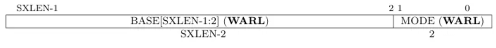
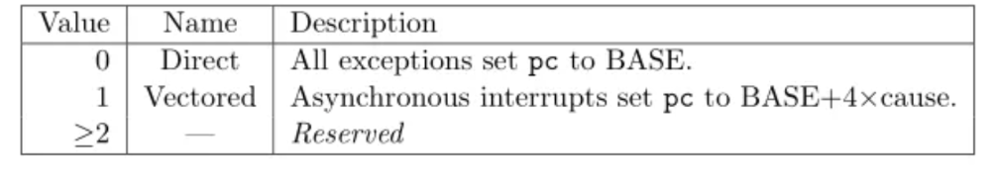

sidebar_position: 18

# 1. 概述
异常处理的关键是在异常发生时，保存CPU当前运行的状态，在退出异常处理时恢复异常处理前的状态。异常能够在指令流水线的各个阶段被识别，CPU硬件会保证后续指令不会改变CPU的状态。异常在指令的边界上被处理，即CPU在指令退休时响应异常，并保存退出异常处理时将被执行指令的地址。即使异常指令退休前被识别，异常也要在相应的指令退休时才会被处理。为了程序功能的正确性，CPU在异常处理结束后要避免重复执行已执行完成的指令。

# 2.异常分类
RISC-V 标准的异常向量表

| 异常向量号 | 异常类型 |
| --- | --- |
| 1 | 取指令访问错误异常 |
| 2 | 非法指令异常 |
| 3 | 调试断点异常 |
| 4 | 加载指令非对齐访问异常 |
| 5 | 加载指令访问错误异常 |
| 6 | 存储/原子指令非对齐访问异常 |
| 7 | 存储/原子指令访问错误异常 |
| 8 | 用户模式环境调用异常 |
| 9 | 超级用户模式环境调用异常 |
| 11 | 机器模式环境调用异常 |
| 12 | 取指页面错误异常 |
| 13 | 加载指令页面错误异常 |
| 15 | 存储/原子访问的虚拟地址 |


# 3.异常处理流程
以在机器模式响应异常为例，具体步骤为：

## 3.1 硬件处理部分（异常（中断）入口）
第一步：处理器保存发生异常的PC到mepc中。

第二步：设置mcause的中断标记为0，将异常编号写入mcause，并更新mtval。

第三步：将mstatus的中断使能位MIE保存到MPIE中，将MIE清零，禁止响应中断。

第四步：将发生异常之前的权限模式保存到 mstatus的MIPP中，切换到机器模式。

第五步：PC从mtvec.BASE处取指令并执行。通常取回的指令是一条跳转指令，跳转至顶层处理函数。

## 3.2 软件（操作系统）处理部分
1. 保存异常发生时的上下文，包含通用寄存器及部分系统寄存器
2. 查询mcasue中的异常向量号，并跳转到对应处理函数中
3. 处理完成后，恢复第一步中的上下文
4. 执行mret指令

示例代码

```plain
/*
   sbi_exception_vector 
   M模式的异常向量入口
   8字节对齐
 */
.align 3
.global sbi_exception_vector
sbi_exception_vector:
    /* 从mscratch获取M模式的sp，把S模式的SP保存到mscratch*/
    csrrw sp, mscratch, sp

    addi sp, sp, -(PT_SIZE)

    sd x1,  PT_RA(sp)
    sd x3,  PT_GP(sp)
    sd x5,  PT_T0(sp)
    sd x6,  PT_T1(sp)
    sd x7,  PT_T2(sp)
    sd x8,  PT_S0(sp)
    sd x9,  PT_S1(sp)
    sd x10, PT_A0(sp)
    sd x11, PT_A1(sp)
    sd x12, PT_A2(sp)
    sd x13, PT_A3(sp)
    sd x14, PT_A4(sp)
    sd x15, PT_A5(sp)
    sd x16, PT_A6(sp)
    sd x17, PT_A7(sp)
    sd x18, PT_S2(sp)
    sd x19, PT_S3(sp)
    sd x20, PT_S4(sp)
    sd x21, PT_S5(sp)
    sd x22, PT_S6(sp)
    sd x23, PT_S7(sp)
    sd x24, PT_S8(sp)
    sd x25, PT_S9(sp)
    sd x26, PT_S10(sp)
    sd x27, PT_S11(sp)
    sd x28, PT_T3(sp)
    sd x29, PT_T4(sp)
    sd x30, PT_T5(sp)
    sd x31, PT_T6(sp)

    /*保存mepc*/
    csrr t0, mepc
    sd t0, PT_MEPC(sp)

    /*保存mstatus*/
    csrr t0, mstatus
    sd t0, PT_MSTATUS(sp)

    /*
       这里有两个目的:
       1. 保存S模式的SP保存到 sbi_trap_regs->sp
       2. 把M模式的SP保存到mscratch， 以便下次陷入到M模式时候可以得到SP
     */
    addi t0, sp, PT_SIZE /* 此时的SP为M模式的SP， mscratch保存的是S模式的SP */
    /* 把M模式的SP保存到mscratch，把S模式的SP保存到 栈框sbi_trap_regs->sp里*/
    csrrw   t0, mscratch, t0
    sd t0, PT_SP(sp)

    /* 调用C语言的sbi_trap_handler */
    mv a0, sp /* sbi_trap_regs */
    call sbi_trap_handler

    /* save context*/
    ld t0, PT_MSTATUS(sp)
    csrw mstatus, t0

    ld t0, PT_MEPC(sp)
    csrw mepc, t0

    ld x1,  PT_RA(sp)
    ld x3,  PT_GP(sp)
    ld x5,  PT_T0(sp)
    ld x6,  PT_T1(sp)
    ld x7,  PT_T2(sp)
    ld x8,  PT_S0(sp)
    ld x9,  PT_S1(sp)
    ld x10, PT_A0(sp)
    ld x11, PT_A1(sp)
    ld x12, PT_A2(sp)
    ld x13, PT_A3(sp)
    ld x14, PT_A4(sp)
    ld x15, PT_A5(sp)
    ld x16, PT_A6(sp)
    ld x17, PT_A7(sp)
    ld x18, PT_S2(sp)
    ld x19, PT_S3(sp)
    ld x20, PT_S4(sp)
    ld x21, PT_S5(sp)
    ld x22, PT_S6(sp)
    ld x23, PT_S7(sp)
    ld x24, PT_S8(sp)
    ld x25, PT_S9(sp)
    ld x26, PT_S10(sp)
    ld x27, PT_S11(sp)
    ld x28, PT_T3(sp)
    ld x29, PT_T4(sp)
    ld x30, PT_T5(sp)
    ld x31, PT_T6(sp)

    ld sp,  PT_SP(sp)
    mret
```

## 3.3 硬件处理部分（异常返回）
1. 从mstatus.MPIE恢复到mstatus.MIE
2. 从mstatus.MPP恢复发生异常时的特权模式
3. 将mepc恢复到PC

示例：mret在qemu中的实现

```plain
target_ulong helper_mret(CPURISCVState *env)
{
    if (!(env->priv >= PRV_M)) {
        riscv_raise_exception(env, RISCV_EXCP_ILLEGAL_INST, GETPC());
    }

    target_ulong retpc = env->mepc;
    if (!riscv_has_ext(env, RVC) && (retpc & 0x3)) {
        riscv_raise_exception(env, RISCV_EXCP_INST_ADDR_MIS, GETPC());
    }

    uint64_t mstatus = env->mstatus;
    target_ulong prev_priv = get_field(mstatus, MSTATUS_MPP);

    if (riscv_cpu_cfg(env)->pmp &&
        !pmp_get_num_rules(env) && (prev_priv != PRV_M)) {
        riscv_raise_exception(env, RISCV_EXCP_INST_ACCESS_FAULT, GETPC());
    }

    target_ulong prev_virt = get_field(env->mstatus, MSTATUS_MPV) &&
                             (prev_priv != PRV_M);
    mstatus = set_field(mstatus, MSTATUS_MIE,
                        get_field(mstatus, MSTATUS_MPIE));
    mstatus = set_field(mstatus, MSTATUS_MPIE, 1);
    mstatus = set_field(mstatus, MSTATUS_MPP,
                        riscv_has_ext(env, RVU) ? PRV_U : PRV_M);
    mstatus = set_field(mstatus, MSTATUS_MPV, 0);
    if ((env->priv_ver >= PRIV_VERSION_1_12_0) && (prev_priv != PRV_M)) {
        mstatus = set_field(mstatus, MSTATUS_MPRV, 0);
    }
    env->mstatus = mstatus;
    riscv_cpu_set_mode(env, prev_priv);

    if (riscv_has_ext(env, RVH)) {
        if (prev_virt) {
            riscv_cpu_swap_hypervisor_regs(env);
        }

        riscv_cpu_set_virt_enabled(env, prev_virt);
    }

    return retpc;
}
```

# 4. 异常（中断）入口设置
## 4.1 [m/s]tvec寄存器
向量基址寄存器（[m/s]tvec）用于配置异常服务程序的入口地址。



上图[m/s]tvec寄存器中的MODE域主要用于定义中断的处理模式，异常入口都是[m/s]tvec.BASE，具体定义如下。




# 5. 异常委派
## 5.1 概述
默认情况下，所有的陷入（中断和异常）都是在M模式下处理，然后再返回到发生陷入前的模式。

所有陷入都在M模式处理会涉及到模式切换，而模式切换是比较消耗性能和时间的。比如：在S模式下发生异常，需要切换到M模式处理中断，然后再返回到S模式。

因此，RISC-V提供了一种异常委派机制，通过该机制可以选择性地将异常交给S模式处理，而完全绕过M模式。

## 5.2 机器模式异常委派控制器（MEDELEG）
| 位 | 说明 |
| :---: | --- |
| 0 | 取指令访问错误异常 |
| 1 | 非法指令异常 |
| 2 | 调试断点异常 |
| 3 | 加载指令非对齐访问异常 |
| 4 | 加载指令访问错误异常 |
| 5 | 存储/原子指令非对齐访问异常 |
| 6 | 存储/原子指令访问错误异常 |
| 7 | 用户模式环境调用异常 |
| 8 | 超级用户模式环境调用异常 |
| 9 | 机器模式环境调用异常 |
| 12 | 取指页面错误异常 |
| 13 | 加载指令页面错误异常 |
| 15 | 存储/原子访问的虚拟地址 |


代码片段

```plain
/* ===== Trap/Exception Causes ===== */
#define CAUSE_MISALIGNED_FETCH          0x0
#define CAUSE_FETCH_ACCESS              0x1
#define CAUSE_ILLEGAL_INSTRUCTION       0x2
#define CAUSE_BREAKPOINT                0x3
#define CAUSE_MISALIGNED_LOAD           0x4
#define CAUSE_LOAD_ACCESS               0x5
#define CAUSE_MISALIGNED_STORE          0x6
#define CAUSE_STORE_ACCESS              0x7
#define CAUSE_USER_ECALL                0x8
#define CAUSE_SUPERVISOR_ECALL          0x9
#define CAUSE_VIRTUAL_SUPERVISOR_ECALL  0xa
#define CAUSE_MACHINE_ECALL             0xb
#define CAUSE_FETCH_PAGE_FAULT          0xc
#define CAUSE_LOAD_PAGE_FAULT           0xd
#define CAUSE_STORE_PAGE_FAULT          0xf
#define CAUSE_FETCH_GUEST_PAGE_FAULT    0x14
#define CAUSE_LOAD_GUEST_PAGE_FAULT     0x15
#define CAUSE_VIRTUAL_INST_FAULT        0x16
#define CAUSE_STORE_GUEST_PAGE_FAULT    0x17
......

void delegate_traps(void)
{
    unsigned long exceptions;

    exceptions = (1UL << CAUSE_MISALIGNED_FETCH) | (1UL << CAUSE_FETCH_PAGE_FAULT) |
                         (1UL << CAUSE_BREAKPOINT) | (1UL << CAUSE_LOAD_PAGE_FAULT) |
                         (1UL << CAUSE_STORE_PAGE_FAULT) | (1UL << CAUSE_USER_ECALL) |
                 (1UL << CAUSE_LOAD_ACCESS) | (1UL << CAUSE_STORE_ACCESS);

     write_csr(medeleg, exceptions);
}
......
```

# 6. 异常在操作系统里的处理
核心代码解析

设置异常服务程序入口地址

```plain
_start
　　_start_kernel
　　　　setup_trap_vector
　　　　　　la a0, handle_exception
　　　　　　csrw CSR_TVEC, a0--设置Trap Vector为handle_exception函数。
```

异常处理入口

```plain
SYM_CODE_START(handle_exception)
    /*
     * If coming from userspace, preserve the user thread pointer and load
     * the kernel thread pointer.  If we came from the kernel, the scratch
     * register will contain 0, and we should continue on the current TP.
     */
    csrrw tp, CSR_SCRATCH, tp
    bnez tp, .Lsave_context

.Lrestore_kernel_tpsp:
    csrr tp, CSR_SCRATCH
    REG_S sp, TASK_TI_KERNEL_SP(tp)

#ifdef CONFIG_VMAP_STACK
    addi sp, sp, -(PT_SIZE_ON_STACK)
    srli sp, sp, THREAD_SHIFT
    andi sp, sp, 0x1
    bnez sp, handle_kernel_stack_overflow
    REG_L sp, TASK_TI_KERNEL_SP(tp)
#endif

.Lsave_context:
    REG_S sp, TASK_TI_USER_SP(tp)
    REG_L sp, TASK_TI_KERNEL_SP(tp)
    addi sp, sp, -(PT_SIZE_ON_STACK)
    REG_S x1,  PT_RA(sp)
    REG_S x3,  PT_GP(sp)
    REG_S x5,  PT_T0(sp)
    save_from_x6_to_x31

    /*
     * Disable user-mode memory access as it should only be set in the
     * actual user copy routines.
     *
     * Disable the FPU/Vector to detect illegal usage of floating point
     * or vector in kernel space.
     */
    li t0, SR_SUM | SR_FS_VS //禁用用户模式内存访问和FPU/Vector。

    REG_L s0, TASK_TI_USER_SP(tp)
    csrrc s1, CSR_STATUS, t0
    csrr s2, CSR_EPC
    csrr s3, CSR_TVAL
    csrr s4, CSR_CAUSE
    csrr s5, CSR_SCRATCH
    REG_S s0, PT_SP(sp)
    REG_S s1, PT_STATUS(sp)
    REG_S s2, PT_EPC(sp)
    REG_S s3, PT_BADADDR(sp)
    REG_S s4, PT_CAUSE(sp)
    REG_S s5, PT_TP(sp)

    /*
     * Set the scratch register to 0, so that if a recursive exception
     * occurs, the exception vector knows it came from the kernel
     */
    csrw CSR_SCRATCH, x0

    /* Load the global pointer */
    load_global_pointer

    /* Load the kernel shadow call stack pointer if coming from userspace */
    scs_load_current_if_task_changed s5

#ifdef CONFIG_RISCV_ISA_V_PREEMPTIVE
    move a0, sp
    call riscv_v_context_nesting_start
#endif
    move a0, sp /* pt_regs *//*
     * MSB of cause differentiates between
     * interrupts and exceptions
     */
    bge s4, zero, 1f //bge的s4是有符号数，根据scause寄存器如果是中断则MSB为1，即负值。所以大于等于0，则是异常。

    /* Handle interrupts */
    call do_irq//进行中断处理。
    j ret_from_exception//返回。
1:
    /* Handle other exceptions */
    slli t0, s4, RISCV_LGPTR//slli是逻辑左移指令。如果是异常，每个异常跳转指针为4字节，根据异常向量号，计算出异常跳转指针在异常向量表中偏移量。
    la t1, excp_vect_table//异常向量表起始地址。
    la t2, excp_vect_table_end//异常向量表结束地址。
    add t0, t1, t0//得到异常对应的异常处理函数指针地址。
    /* Check if exception code lies within bounds */
    bgeu t0, t2, 3f//检查异常函数是否在范围内。
    REG_L t1, 0(t0)//加载异常处理函数到寄存器t1。
2:    jalr t1//跳转到异常函数处理。
    j ret_from_exception//返回。
3:

    la t1, do_trap_unknown//处理无法识别的异常。
    j 2b
SYM_CODE_END(handle_exception)
```

异常向量表

```plain
.section ".rodata"
    .align LGREG
    /* Exception vector table */
ENTRY(excp_vect_table)
    RISCV_PTR do_trap_insn_misaligned
    ALT_INSN_FAULT(RISCV_PTR do_trap_insn_fault)
    RISCV_PTR do_trap_insn_illegal
    RISCV_PTR do_trap_break
    RISCV_PTR do_trap_load_misaligned
    RISCV_PTR do_trap_load_fault
    RISCV_PTR do_trap_store_misaligned
    RISCV_PTR do_trap_store_fault
    RISCV_PTR do_trap_ecall_u /* system call, gets intercepted */
    RISCV_PTR do_trap_ecall_s
    RISCV_PTR do_trap_unknown
    RISCV_PTR do_trap_ecall_m
    /* instruciton page fault */
    ALT_PAGE_FAULT(RISCV_PTR do_page_fault)
    RISCV_PTR do_page_fault   /* load page fault */
    RISCV_PTR do_trap_unknown
    RISCV_PTR do_page_fault   /* store page fault */
excp_vect_table_end:
END(excp_vect_table)
```

# 7. 异常相关CSR寄存器总结

将RISC-V架构中所有异常相关的寄存器加以总结，如下表所示

| 寄存器名 | 机器模式 | 超级用户模式 | 说明 |
| --- | --- | --- | --- |
| 状态寄存器 | mstatus | status | 存储了处理器在机器模式/超级用户模式下的状态和控制信息，包括全局中断有效位、异常保留中断有效位、异常保留特权模式位等。 |
| 异常降级控制寄存器 | medeleg | ------ | 异常降级到超级用户模式响应。 |
| 中断降级控制寄存器 | mideleg | ------ | 中断降级到超级用户模式响应。 |
| 中断使能控制器 | mie | sie | 用于控制不同中断类型的使能和屏蔽。 |
| 向量基址寄存器 | mtvec | stvec | 用于配置异常服务程序的入口地址。 |
| 异常保留程序计数器寄存器 | mepc | sepc | 用于存储程序从异常服务程序退出时要返回的程序计数器值(即PC值)。 |
| 异常事件向量寄存器 | mcause | scause | 用于保存触发异常的异常事件向量号，用于在异常服务程序中处理对应事件。 |
| 中断等待状态寄存器 | mip | sip | 用于保存处理器的中断等待状态。当处理器出现中断无法立即响应的情况时，MIP寄存器中的对应位会被置位。|


# 8. 示例

## 8.1 进入示例
[下载实验代码-异常](code/exception/)

下载解压并进入示例目录

## 8.2 编译

```plain
make
```

## 8.3 运行

```plain
make run
```

**运行后LOG如下**
```plain
   _____ ____ _____
   / ____|  _ \_   _|
 | (___ | |_) || |
  \ \___ \|  _ < | |
  ____) | |_) || |_
 |_|_____/|____/_____|
stvec=0x80200974, 0x80200974
sstatus:0x200000000
sstatus:0x200000002
sbi_ecall_handle get ecall demo
```
详见请参考文档：实验环境搭建。
