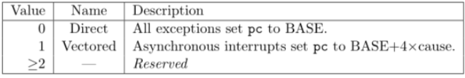
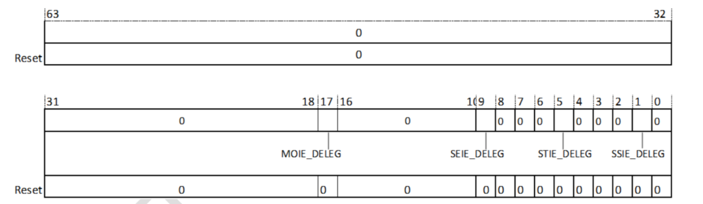
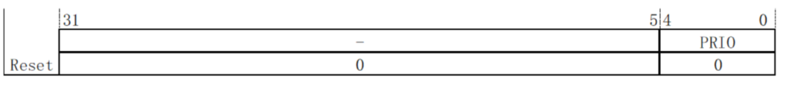
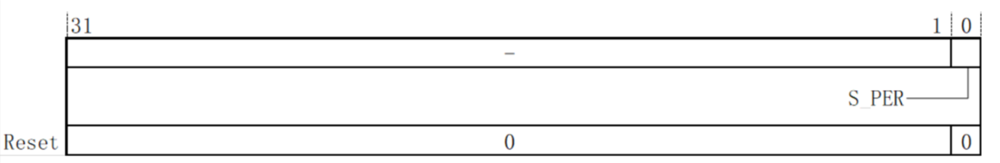
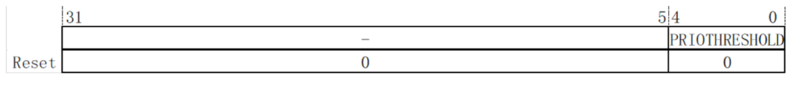
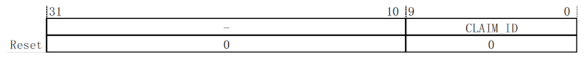

# 1. 概述
中断处理的关键是在中断发生时，保存CPU当前运行的状态，在退出中断处理时恢复中断处理前的状态。中断能够在指令流水线的各个阶段被识别，CPU硬件会保证后续指令不会改变CPU的状态。中断在指令的边界上被处理，即CPU在指令退休时响应中断，并保存退出中断处理时将被执行指令的地址。即使中断指令退休前被识别，中断也要在相应的指令退休时才会被处理。为了程序功能的正确性，CPU在中断处理结束后要避免重复执行已执行完成的指令。

# 2. 架构
<font style="color:rgb(77, 77, 77);">RISC-V 中断被分为两类中断，局部中断和全局中断。</font>

+ <font style="color:rgb(51, 51, 51);">局部中断，算是内部中断，标准是只规定了有两种，即使中断timer和软件中断software。局部中断连接在Core Local Interruptor (CLINT) 上。</font>
+ <font style="color:rgb(51, 51, 51);">全局中断，也就是所说的外部中断，其他外设统统都是外部中断。外部中断连接在Platform-Level Interrupt Controller (PLIC)上。</font>


# 3. 中断分类
RISC-V 标准的中断向量表

**注意：中断标记位为“1”**

| 中断向量号 | 中断类型 |
| --- | --- |
| 1 | 超级用户模式软件中断 |
| 2 | 保留 |
| 3 | 机器模式软件中断 |
| 4 | 未实现 |
| 5 | 超级用户模式计时器中断 |
| 6 | 保留 |
| 7 | 机器模式计时器中断 |
| 8 | 未实现 |
| 9 | 超级用户模式外部中断 |
| 10 | 保留 |
| 11 | 机器模式外部中断 |
| 17 | 性能监测溢出中断(如配置性能监测单元) |


# 4. 中断处理流程
以在机器模式响应中断为例，具体步骤为：

## 4.1 硬件处理部分（中断入口）
第一步：处理器保存发生中断的PC到mepc中。

第二步：设置mcause的中断标记为1，将中断编号写入mcause，并更新mtval。

第三步：将mstatus的中断使能位MIE保存到MPIE中，将MIE清零，禁止响应中断。

第四步：将发生中断之前的权限模式保存到mstatus的MIPP中，切换到机器模式。

第五步：PC从mtvec.BASE处取指令并执行。通常取回的指令是一条跳转指令，跳转至顶层处理函数。

## 4.2 软件（操作系统）处理部分
1. 保存中断发生时的上下文，包含通用寄存器及部分系统寄存器
2. 查询mcasue中的中断向量号，并跳转到对应处理函数中
3. 处理完成后，恢复第一步中的上下文
4. 执行mret指令

示例代码

```plain
/*
   sbi_exception_vector 
   M模式的异常向量入口
   8字节对齐
 */
.align 3
.global sbi_exception_vector
sbi_exception_vector:
    /* 从mscratch获取M模式的sp，把S模式的SP保存到mscratch*/
    csrrw sp, mscratch, sp

    addi sp, sp, -(PT_SIZE)

    sd x1,  PT_RA(sp)
    sd x3,  PT_GP(sp)
    sd x5,  PT_T0(sp)
    sd x6,  PT_T1(sp)
    sd x7,  PT_T2(sp)
    sd x8,  PT_S0(sp)
    sd x9,  PT_S1(sp)
    sd x10, PT_A0(sp)
    sd x11, PT_A1(sp)
    sd x12, PT_A2(sp)
    sd x13, PT_A3(sp)
    sd x14, PT_A4(sp)
    sd x15, PT_A5(sp)
    sd x16, PT_A6(sp)
    sd x17, PT_A7(sp)
    sd x18, PT_S2(sp)
    sd x19, PT_S3(sp)
    sd x20, PT_S4(sp)
    sd x21, PT_S5(sp)
    sd x22, PT_S6(sp)
    sd x23, PT_S7(sp)
    sd x24, PT_S8(sp)
    sd x25, PT_S9(sp)
    sd x26, PT_S10(sp)
    sd x27, PT_S11(sp)
    sd x28, PT_T3(sp)
    sd x29, PT_T4(sp)
    sd x30, PT_T5(sp)
    sd x31, PT_T6(sp)

    /*保存mepc*/
    csrr t0, mepc
    sd t0, PT_MEPC(sp)

    /*保存mstatus*/
    csrr t0, mstatus
    sd t0, PT_MSTATUS(sp)

    /*
       这里有两个目的:
       1. 保存S模式的SP保存到 sbi_trap_regs->sp
       2. 把M模式的SP保存到mscratch， 以便下次陷入到M模式时候可以得到SP
     */
    addi t0, sp, PT_SIZE /* 此时的SP为M模式的SP， mscratch保存的是S模式的SP */
    /* 把M模式的SP保存到mscratch，把S模式的SP保存到 栈框sbi_trap_regs->sp里*/
    csrrw   t0, mscratch, t0
    sd t0, PT_SP(sp)

    /* 调用C语言的sbi_trap_handler */
    mv a0, sp /* sbi_trap_regs */
    call sbi_trap_handler

    /* save context*/
    ld t0, PT_MSTATUS(sp)
    csrw mstatus, t0

    ld t0, PT_MEPC(sp)
    csrw mepc, t0

    ld x1,  PT_RA(sp)
    ld x3,  PT_GP(sp)
    ld x5,  PT_T0(sp)
    ld x6,  PT_T1(sp)
    ld x7,  PT_T2(sp)
    ld x8,  PT_S0(sp)
    ld x9,  PT_S1(sp)
    ld x10, PT_A0(sp)
    ld x11, PT_A1(sp)
    ld x12, PT_A2(sp)
    ld x13, PT_A3(sp)
    ld x14, PT_A4(sp)
    ld x15, PT_A5(sp)
    ld x16, PT_A6(sp)
    ld x17, PT_A7(sp)
    ld x18, PT_S2(sp)
    ld x19, PT_S3(sp)
    ld x20, PT_S4(sp)
    ld x21, PT_S5(sp)
    ld x22, PT_S6(sp)
    ld x23, PT_S7(sp)
    ld x24, PT_S8(sp)
    ld x25, PT_S9(sp)
    ld x26, PT_S10(sp)
    ld x27, PT_S11(sp)
    ld x28, PT_T3(sp)
    ld x29, PT_T4(sp)
    ld x30, PT_T5(sp)
    ld x31, PT_T6(sp)

    ld sp,  PT_SP(sp)
    mret
```

## 4.3 硬件处理部分（中断返回）
1. 从mstatus.MPIE恢复到mstatus.MIE
2. 从mstatus.MPP恢复发生中断时的特权模式
3. 将mepc恢复到PC

示例：mret在qemu中的实现

```plain
target_ulong helper_mret(CPURISCVState *env)
{
    if (!(env->priv >= PRV_M)) {
        riscv_raise_exception(env, RISCV_EXCP_ILLEGAL_INST, GETPC());
    }

    target_ulong retpc = env->mepc;
    if (!riscv_has_ext(env, RVC) && (retpc & 0x3)) {
        riscv_raise_exception(env, RISCV_EXCP_INST_ADDR_MIS, GETPC());
    }

    uint64_t mstatus = env->mstatus;
    target_ulong prev_priv = get_field(mstatus, MSTATUS_MPP);

    if (riscv_cpu_cfg(env)->pmp &&
        !pmp_get_num_rules(env) && (prev_priv != PRV_M)) {
        riscv_raise_exception(env, RISCV_EXCP_INST_ACCESS_FAULT, GETPC());
    }

    target_ulong prev_virt = get_field(env->mstatus, MSTATUS_MPV) &&
                             (prev_priv != PRV_M);
    mstatus = set_field(mstatus, MSTATUS_MIE,
                        get_field(mstatus, MSTATUS_MPIE));
    mstatus = set_field(mstatus, MSTATUS_MPIE, 1);
    mstatus = set_field(mstatus, MSTATUS_MPP,
                        riscv_has_ext(env, RVU) ? PRV_U : PRV_M);
    mstatus = set_field(mstatus, MSTATUS_MPV, 0);
    if ((env->priv_ver >= PRIV_VERSION_1_12_0) && (prev_priv != PRV_M)) {
        mstatus = set_field(mstatus, MSTATUS_MPRV, 0);
    }
    env->mstatus = mstatus;
    riscv_cpu_set_mode(env, prev_priv);

    if (riscv_has_ext(env, RVH)) {
        if (prev_virt) {
            riscv_cpu_swap_hypervisor_regs(env);
        }

        riscv_cpu_set_virt_enabled(env, prev_virt);
    }

    return retpc;
}
```

# 5. 中断(异常)入口设置
## 5.1 [m/s]tvec寄存器

向量基址寄存器（[m/s]tvec）用于配置中断服务程序的入口地址。


上图[m/s]tvec寄存器中的MODE域主要用于定义中断的处理模式，具体定义如下。



- 直接模式（MODE=0）
    中断处理程序的入口地址是直接硬编码在([m/s]tvec)寄存器的BASE域中。当一个中断发生时，处理器直接跳转到[m/s]tvec.BASE的地址开始执行处理程序。
- 向量模式（MODE=1）
    中断处理程序的入口地址是通过一个向量表来确定的。向量表的入口地址编码在([m/s]tvec)寄存器的BASE域中，当一个中断发生时，处理器根据中断号查找向量表(BASE + 4*cause)，向量表中存储了每个中断对应的处理程序的入口地址。处理器跳转到该入口地址开始执行处理程序。

```plain
void trap_init(void)
{
    /* 设置异常向量表地址及MODE=0 */
    write_csr(mtvec, sbi_exception_vector);
}
```

向量访问模式(mtvec.MODE=1)

```plain
void trap_init(void)
{
    /* 设置异常向量表地址及MODE=1 */
    write_csr(mtvec, sbi_exception_vector | 1);
}
```

# 6. 中断委派
## 6.1 概述
默认情况下，所有的陷入（中断和异常）都是在M模式下处理，然后再返回到发生陷入前的模式；

所有陷入都在M模式处理会涉及到模式切换，而模式切换是比较消耗性能和时间的。比如：在S模式下发生中断，需要切换到M模式处理中断，然后再返回到S模式,因此，RISC-V提供了一种异常委派机制，通过该机制可以选择性地将异常交给S模式处理，而完全绕过M模式。

## 6.2 机器模式中断委派控制器（MIDELEG）


| 位 | 名称 | 说明 |
| :---: | :---: | --- |
| 1 | ssie_deleg | 超级用户模式软件中断 |
| 5 | stie_deleg | 超级用户模式计时器中断 |
| 9 | seie_deleg | 超级用户模式外部中断 |
| 17 | moie_deleg | 性能监测单元事件计数器溢出中断 |


代码片段

```c
#define MIP_SSIP (1UL << IRQ_S_SOFT)
#define MIP_STIP  (1UL << IRQ_S_TIMER)
#define MIP_SEIP  (1UL << IRQ_S_EXT)
#define MIP_MTIP  (1UL << IRQ_M_TIMER)
......

void delegate_traps(void)
{
    unsigned long interrupts;

    interrupts = MIP_SSIP | MIP_STIP | MIP_SEIP;
    write_csr(mideleg, interrupts);
}
......
```

中断处理代码

示例代码

```c
void do_exception(struct pt_regs *regs, unsigned long scause)
{
	const struct fault_info *inf;

	if (is_interrupt_fault(scause)) {
		switch (scause &~ SCAUSE_INT) {
		case INTERRUPT_CAUSE_TIMER:
			handle_timer_irq();
			break;
		case INTERRUPT_CAUSE_EXTERNAL:
			plic_handle_irq(regs);
			break;
		case INTERRUPT_CAUSE_SOFTWARE:
		/* handle IPI */
			break;
		default:
			printk("unexpected interrupt cause");
			panic();
		}
	} else {
		inf = ec_to_fault_info(scause);
		
		if (!inf->fn(regs, inf->name))
			return;
	}
}
```

# 7. 中断在操作系统里的处理
核心代码解析

设置中断服务程序入口地址

```plain
_start
　　_start_kernel
　　　　setup_trap_vector
　　　　　　la a0, handle_exception
　　　　　　csrw CSR_TVEC, a0--设置Trap Vector为handle_exception函数。
```

中断处理入口

```c
SYM_CODE_START(handle_exception)
    /*
     * If coming from userspace, preserve the user thread pointer and load
     * the kernel thread pointer.  If we came from the kernel, the scratch
     * register will contain 0, and we should continue on the current TP.
     */
    csrrw tp, CSR_SCRATCH, tp
    bnez tp, .Lsave_context

.Lrestore_kernel_tpsp:
csrr tp, CSR_SCRATCH
    REG_S sp, TASK_TI_KERNEL_SP(tp)

    #ifdef CONFIG_VMAP_STACK
    addi sp, sp, -(PT_SIZE_ON_STACK)
    srli sp, sp, THREAD_SHIFT
    andi sp, sp, 0x1
    bnez sp, handle_kernel_stack_overflow
    REG_L sp, TASK_TI_KERNEL_SP(tp)
    #endif

    .Lsave_context:
REG_S sp, TASK_TI_USER_SP(tp)
    REG_L sp, TASK_TI_KERNEL_SP(tp)
    addi sp, sp, -(PT_SIZE_ON_STACK)
    REG_S x1,  PT_RA(sp)
    REG_S x3,  PT_GP(sp)
    REG_S x5,  PT_T0(sp)
    save_from_x6_to_x31

    /*
     * Disable user-mode memory access as it should only be set in the
     * actual user copy routines.
     *
     * Disable the FPU/Vector to detect illegal usage of floating point
     * or vector in kernel space.
     */
    li t0, SR_SUM | SR_FS_VS //禁用用户模式内存访问和FPU/Vector。

    REG_L s0, TASK_TI_USER_SP(tp)
    csrrc s1, CSR_STATUS, t0
    csrr s2, CSR_EPC
    csrr s3, CSR_TVAL
    csrr s4, CSR_CAUSE
    csrr s5, CSR_SCRATCH
    REG_S s0, PT_SP(sp)
    REG_S s1, PT_STATUS(sp)
    REG_S s2, PT_EPC(sp)
    REG_S s3, PT_BADADDR(sp)
    REG_S s4, PT_CAUSE(sp)
    REG_S s5, PT_TP(sp)

    /*
     * Set the scratch register to 0, so that if a recursive exception
     * occurs, the exception vector knows it came from the kernel
     */
    csrw CSR_SCRATCH, x0

    /* Load the global pointer */
    load_global_pointer

    /* Load the kernel shadow call stack pointer if coming from userspace */
    scs_load_current_if_task_changed s5

#ifdef CONFIG_RISCV_ISA_V_PREEMPTIVE
    move a0, sp
    call riscv_v_context_nesting_start
#endif
    move a0, sp /* pt_regs *//*
     * MSB of cause differentiates between
     * interrupts and exceptions
     */
    bge s4, zero, 1f //bge的s4是有符号数，根据scause寄存器如果是中断则MSB为1，即负值。所以大于等于0，则是异常。

    /* Handle interrupts */
    call do_irq//进行中断处理。
    j ret_from_exception//返回。
1:
/* Handle other exceptions */
slli t0, s4, RISCV_LGPTR//slli是逻辑左移指令。如果是异常，每个异常跳转指针为4字节，根据异常向量号，计算出异常跳转指针在异常向量表中偏移量。
    la t1, excp_vect_table//异常向量表起始地址。
    la t2, excp_vect_table_end//异常向量表结束地址。
    add t0, t1, t0//得到异常对应的异常处理函数指针地址。
    /* Check if exception code lies within bounds */
    bgeu t0, t2, 3f//检查异常函数是否在范围内。
    REG_L t1, 0(t0)//加载异常处理函数到寄存器t1。
    2:    jalr t1//跳转到异常函数处理。
        j ret_from_exception//返回。
        3:

la t1, do_trap_unknown//处理无法识别的异常。
    j 2b
SYM_CODE_END(handle_exception)
```


# 8. PLIC
## 8.1 概述
<font style="color:rgb(25, 27, 31);">PLIC(platform-level interrupt controller)，平台级中断控制器。用来将外部的全局中断请求处理后转至中断目标。PLIC理论上支持1023个外部中断源。</font>

<font style="color:rgb(25, 27, 31);">寄存器映射表：</font>

| 地址 | 名称 | 描述 |
| --- | --- | --- |
| 0x0000004 | PLIC PRIO1 | 1-1023号中断的优先级配置寄存器 |
| 0x0000008 | PLIC PRIO2 | |
| 0x000000C | PLIC PRIO3 | |
| ...... | ...... | |
| 0x0000FFC | PLIC PRIO1023 | |
| ...... | ...... | ...... |
| 0x0001000 | PLIC_IP0 | 1-1023号中断的中断等待寄存器 |
| ...... | ...... | |
| 0x000107C | PLIC_IP31 | |
| ...... | ...... | ...... |
| 0x0002000 | PLIC_H0_MIE0 | <font style="color:rgb(25, 27, 31);">1-1023号中断的机器模式中断使能寄存器</font> |
| ...... | ...... | |
| 0x000207C | PLIC_H0_MIE31 | |
| ...... | ...... | ...... |
| 0x0002080 | PLIC_H0_SIE0 | <font style="color:rgb(25, 27, 31);">1-1023号中断的超级用户模式中断使能寄存器</font> |
| ...... | ...... | |
| 0x00020FC | PLIC_H0_SIE31 | |
| ...... | ...... | ...... |
| 0x1FFFFC | PLIC_CTRL | PLIC 权限控制寄存器 |
| 0x200000 | PLIC_H0_MTH | 机器模式中断阈值寄存器 |
| 0x200004 | PLIC_H0_MCLAM | 机器模式中断响应/完成寄存器 |
| ...... | ...... | ...... |
| 0x201000 | PLIC_H0_STH | 超级用户模式中断阈值寄存器 |
| 0x201004 | PLIC_H0_SCLAM | 超级用户模式中断响应/完成寄存器 |


## 8.2 中断的优先级配置寄存器（PLIC_PRIO）
每一个中断源均可通过修改地址映射的32位寄存器配置其优先级。寄存器当前值即为该中断源优先级，寄存器位分布和位定义如下。




## 8.3 中断等待寄存器(PLIC_IP)
每一个中断源的等待状态都可以通过读取中断等待寄存器中的信息获取。对于中断ID为N的中断，其中断信息存

储于PLIC_IPx(x=N/32)寄存器中的IPy上(y=Nmod32)。其中PLIC_IP0寄存器的第0位固定绑0，寄存器位分布和位定义如下。


## 8.4 中断使能寄存器(PLIC_IE)
每个中断目标对每个中断源均有一个中断使能位(机器模式中I断使能和超级用户模式中断使能)，可用于使能对应中

断。其中机器模式中断使能寄存器用于使能机器模式中断，超级用户模式中断使能寄存器用于使能超级用户模式中断。

对于中断ID为N的中断，其中断使能信息存储于PLIC IEx(x=N/32)寄存器中的IEy上(y=Nmod32)。

其中ID0对应的IE位固定绑0。寄存器位分布和位定义如下。


## 8.5 PLIC 权限控制寄存器(PLIC_CTRL)
PLIC 权限控制寄存器用于控制超级用户模式对PLIC部分寄存器的访问权限




**S_PER--访问权限控制位:**

在S_PER为0时，仅机器模式拥有访问PLIC所有寄存器的权限。超级用户模式没有PLIC_CTRL，PLIC_PRIO，PLIC_IP和PLIC_IE 寄存器的访问权限，仍又能访问超级用户模式中断阈值寄存器和超级用户模式中断响应/完成寄存器。普通用户模式没有任何PLIC寄存器的访问权限。在S_PER为1时，机器模式拥有访问PLIC所有寄存器的木权限。超级用户模式拥有除PLIC_CTRL以外的所有PLIC寄存器访问权限。普通用户模式没有任何PLIIC 寄存器的访问权限。


## 8.6 中断阈值寄存器(PLIC_TH)
每一个中断模式均有一个对应的中断阈值寄存器。仅有优先先级大于中断阈值的有效中断才会向核内发起中断请求，寄存器位分布和位定义如下。




**PRIOTHRESHOLD-优先级阈值:**

指示当前中断模式的中断阈值。阈值配置为0，表示允许所有中断。


## 8.7 中断响应/完成寄存器(PLIC_CLAIM)
每一个中断模式均有一个对应的中断响应/完成寄存器。该寄存器得在PLIC完成仲裁时更新，更新值为PLIC本次

仲裁结果的中断ID，寄存器位分布和位定义如下




CLAIM_ID--中断请求ID:

对该寄存器的读操作:返回寄存器当前存储的ID值。该读操作表表示对应ID的中断已开始处理。PLIC开始中断响应处理参见中断请求与响应。

对该寄存器的写操作:表示对应ID的中断已完成处理，该写操作不会更新中断响应响应/完成寄存器。PLIC开始

中断完成处理中断完成。


示例代码

```plain
//Init id 1 machine mode int for hart 0
/*1.set hart threshold if needed*/
li x3, (plic_base_addr + 0x20000000) // h0 mthreshold addr
li x4, Oxa //threshold value
sw x4,0x0(x3) // set hart0 threshold as 0xa


```

# 9. CLINT

## 9.1 概述
‌CLINT（Core-Local Interruptor）是RISC-V架构中的一个本地中断控制器，主要用于处理本地中断，如软件中断和定时器中断。‌ CLINT占用空间较小，直接向hart（硬件线程）提供软件及定时器中断。
## 9.2 软件中断
软件中断是通过写入内存映射控制寄存器 msip 来生成的。
msip 寄存器是一个 32 位宽的 WARL 寄存器，其中高 31 位绑定为 0。最低有效位反映在 mip CSR 的 MSIP 位中。msip 寄存器中的其他位被硬连线为零。复位时，每个 msip 寄存器都清零。
软件中断对于多 hart 系统中的处理器间通信最有用 ，因为 harts 可能会写入彼此的 msip 位以影响处理器间中断。
软件中断其实更多的用于多核之间，也就是所谓的核间通信。
## 9.3 定时器中断
与timer有关的寄存器主要是两个：mtime和mtimecmp
mtime 是一个 64 位读写寄存器，只要 mtime 大于或等于 mtimecmp 寄存器中的值，定时器中断就会挂起。定时器中断反映在 mip 寄存器的 mtip 位中。复位时，mtime 被清零，mtimecmp 不会重置。

# 10. 示例

## 10.1. 进入示例
[下载实验代码-中断](code/interrupt/)

下载解压并进入示例目录


## 10.2. 编译

```plain
make
```


## 10.3. 运行

```plain
make run
```

**运行后LOG如下**
```plain
   _____ ____ _____
   / ____|  _ \_   _|
 | (___ | |_) || |
  \ \___ \|  _ < | |
  ____) | |_) || |_
 |_|_____/|____/_____|
 stvec=0x80200ef8, 0x80200ef8
sstatus:0x200000000
sstatus:0x200000002 sie:0x222
handle_uart_irq occurred for '\r'
handle_uart_irq occurred for '\r'
handle_uart_irq occurred for '\r'
```
详见请参考文档：实验环境搭建。
