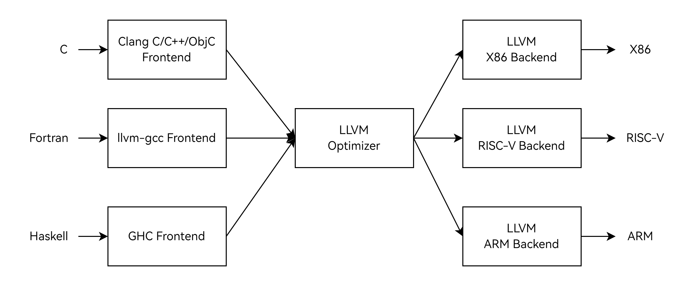
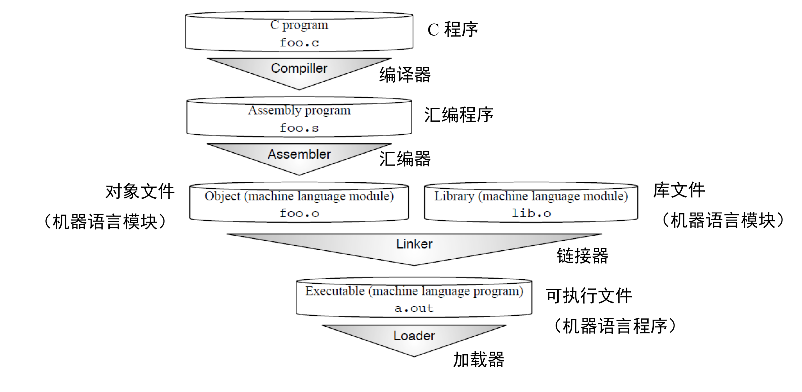

# 1. 工具链组成
## 1.1 工具链简介

计算机的世界里，计算机硬件的核心——CPU，只能够识别二进制指令。不同的计算机架构（如X86，ARM，RISC-V）各自定义了ISA（指令集架构，Instruction Set Architecture），这可以看作是CPU所认识的“语言”。ISA明确规定了CPU能够执行的指令类型、数据格式、寄存器组织等重要信息，它是计算机硬件与软件之间的重要接。

然而，人类在编写程序时，通常使用高级语言，如C、C++、Java等。这些高级语言具有丰富的语法结构、数据类型和抽象概念，更符合人类的思维方式，便于人类进行程序的编写和理解。但是，CPU无法直接理解这些高级语言编写的代码。

这时候就需要工具链发挥作用了。工具链就像是一座桥梁，连接着人类编写的高级语言程序和只能识别二进制的CPU。它包含了一系列的工具和组件，如编译器、汇编器、链接器等。首先，编译器会将高级语言编写的源代码进行词法分析、语法分析、语义分析等操作，将其转换为汇编语言代码。汇编语言虽然比高级语言更接近机器语言，但仍然不是CPU能够直接执行的二进制指令。接着，汇编器会把汇编语言代码转换为目标文件，这个目标文件包含了机器码，但可能还不是一个完整的可执行文件。最后，链接器会将多个目标文件以及相关的库文件进行整合，处理符号引用等问题，最终生成一个可以被CPU直接执行的二进制可执行文件。通过工具链的这一系列处理过程，人类编写的高级语言程序才能够在计算机的CPU上顺利执行，从而实现各种复杂的功能。

## 1.2 编译器
有时候人们会用编译器指代整个编译工具链，但解析工具链的具体组件时，编译器则只是工具链的一部分，是一种将高级编程语言转换为汇编语言的软件工具。具体编译器一词的指代范围需要结合上下文理解。

早期，随着计算机编程的发展，为了能让计算机理解人类编写的高级语言，编译器应运而生。在20世纪80年代，GCC（GNU Compiler Collection）开始发展，最初它只是GNU计划中的一部分，GNU计划旨在创建一个完全兼容于UNIX的自由软件环境。GCC原名为GNU C语言编译器，后来快速演进，能够处理多种编程语言，如C++、Fortran、Pascal、Objective - C、Java以及Ada等。

LLVM（Low Level Virtual Machine）则是伊利诺伊大学为了提供一个现代的、基于SSA（静态单一赋值）的、可以动态、静态编译任何编程语言的编译方案而开展的研究项目。

随着技术发展，目前GCC和LLVM在开源编译器领域占据主流地位。作为一种新兴架构，RISC-V在LLVM上的开发相对更加活跃一些。

调用GNU工具链编译一个C/C++程序时，调用gcc/g++命令。调用LLVM工具链编译一个C程序时，调用的是clang/clang++命令。Clang是LLVM的前端，可以用来编译C，C++，ObjectiveC等语言。

### 1.2.1 编译器的结构

经典编译器通常分为三个部分：


前端（Frontend）
主要负责词法和语法分析，将源代码转化为抽象语法树（AST）。例如，对于输入的源代码，前端会识别其中的关键字、标识符、操作符等基本元素，并根据语法规则构建出抽象语法树这种数据结构，它是源代码的一种抽象表示。

优化器（Optimizer）
在前端的基础上，对得到的中间代码（例如由抽象语法树转换而来的中间表示形式）进行优化，使代码更加高效。这可能包括常量折叠（如将表达式“2 + 3”在编译时计算为“5”）、死代码消除（去除永远不会被执行的代码段）等优化操作。

后端（Backend）
将已经优化的中间代码转化为针对各自平台的机器代码。不同的硬件平台（如RISC-V架构和ARM架构）有不同的指令集，后端会根据目标平台的指令集特点生成相应的机器码。例如，对于RISC-V平台，后端会生成符合RISC-V指令集规范的机器码，以便在RISC-V架构的计算机上运行。

基于这种解耦的编译器结构，支持一种新的编程语言只需要新增一个前端，新增一种硬件架构则只需要新增一个后端，中间的优化器部分基本可以复用。



## 1.3 汇编器
汇编器是一种将汇编语言源程序转换为机器语言目标程序的系统软件。
汇编语言非常接近底层机器指令，但仍然是一种人类可读的格式。经过汇编器转换后才变成真正的二进制格式，能直接被CPU读取执行。

GNU工具链的汇编器是as，LLVM工具链的汇编器是llvm-as。

## 1.4 链接器
链接器是用于将编译产生的目标文件及所需的库文件组合起来，并解决符号引用和重定位等问题，从而生成可执行文件或库文件的工具。

GNU工具链的链接器是ld，LLVM工具链的汇编器lld。

## 1.5 加载器
加载器负责将编译产生的目标文件加载到内存中，还承担处理地址重定位等任务，并且能够处理动态库，确保程序运行时可正确调用动态库。

加载器由C库提供，典型的名字为ld\.so

## 1.6 C库
C库是编译工具链的重要组成部分，它提供了大量的函数和宏定义等资源。Linux环境下最流行的C库是Glibc，但也可以选择Musl等其他C库。

## 1.7 工具链命名
编译可以按照工具链本身运行的架构和生成的可执行文件架构是否一致，分为交叉编译和native编译。
即，在X86的机器上，编译一个RISC-V的可执行文件，称为交叉编译。在RISC-V的机器上，编译一个RISC-V的可执行文件，称为native编译。

工具链的命名通常包含目标架构、操作系统以及编译器相关的信息，有可能还会进一步包含编译器版本或特殊标识说明。
以 riscv64-unknown-linux-gnu-gcc 为例，riscv64表示目标架构是RISC-V的64位版本，unknown所在的字段通常表示目标系统的一些特定信息（如供应商等），当不明确或者没必要强调时，则使用unknown或者直接省略，linux表明目标操作系统是Linux，这意味着编译出来的程序是为在Linux系统下运行而构建的，并且在编译过程中会考虑Linux系统的特性，例如系统调用接口、库文件的组织等，gnu表示这个工具链遵循GNU（GNU's Not Unix）的相关规范，gcc表示这个工具链中的编译器是GCC。

对于交叉编译，x86机器上的gcc命令一般是链接到x86 native gcc，所以交叉编译一般需要明确指定工具链名称，如使用riscv64-unknown-linux-gnu-gcc命令。
对于native编译，RISC-V机器上的gcc命令就是直接可用的，当然也可以查看gcc命令最终链接的完整名字，并使用该完整的名字。
一般使用ls -l命令即可查看对应的软链接文件指向的文件，例如在系统中看到如下链接关系：
```
root@k1:~# type gcc
gcc 是 /usr/bin/gcc
root@k1:~# ls -l /usr/bin/gcc
lrwxrwxrwx 1 root root 6 2024年 1月31日 /usr/bin/gcc -> gcc-13
root@k1:~# ls -l /usr/bin/gcc-13
lrwxrwxrwx 1 root root 24 2024年 4月28日 /usr/bin/gcc-13 -> riscv64-linux-gnu-gcc-13
root@k1:~# ls -l /usr/bin/riscv64-linux-gnu-gcc-13
-rwxr-xr-x 1 root root 2203776 2024年 4月28日 /usr/bin/riscv64-linux-gnu-gcc-13
```
则此时使用gcc, gcc-13, riscv64-linux-gnu-gcc-13这三条命令的本质使用效果是一样的。

# 2. 整体编译流程



以foo.c的编译为例，经过编译器编译之后，会生成后缀为foo.s汇编文件。foo.s经过汇编器，会生成foo.o的一个ELF格式的文件。这个程序中可能引用了外部的库文件，例如使用printf打印的话，其实是由C库提供具体的printf实现。随后链接器会将foo.o和使用到的库文件lib.o收集到一起，链接生成a.out，这个就是可执行文件了，可以直接执行。真正在操作系统中执行./a.out时，其实是调用了加载器，由加载器将a.out加载到内存中执行。

# 3. 常用二进制处理工具
除了以上介绍过的处理编译过程的工具，工具链还提供了其他实用工具，以下列举几个常用的工具

- objdump
主要用于显示目标文件（可重定位文件、可执行文件或共享库等）的信息。它可以反汇编目标文件中的机器码，显示其中的汇编指令。例如，objdump -D a.out可以对可执行文件a.out进行反汇编并显示结果。
有助于分析程序的二进制结构，在调试中非常有用。

- readelf
专门用于查看ELF（Executable and Linkable Format）格式文件的信息。ELF是Linux系统下可执行文件、目标文件和共享库等的标准格式。通过readelf可以查看文件头、节头表、符号表等重要信息。例如，readelf -h a.out可以查看可执行文件a.out的文件头信息。
有助于排查与ELF文件格式相关的问题，如符号解析错误等。

- nm
用于显示目标文件中的符号表信息。符号表包含了程序中的函数名、全局变量名等符号以及它们的地址等相关信息。例如，nm a.out可以显示可执行文件a.out的符号表。
有助于程序的调试和分析模块间的关系，比如查看库文件中导出了哪些函数等。

- strip
用于去除目标文件、可执行文件或共享库中的符号信息和调试信息。例如，对于一个可执行文件a.out，可以使用strip a.out命令来减小文件的大小。
有助于减少资源开销和信息保护。

- ldd
用于查看可执行文件或共享库所依赖的共享库。当运行一个可执行文件时，它可能依赖于多个共享库才能正常工作，ldd可以列出这些依赖关系。例如，对于一个名为a.out的可执行文件，运行ldd a.out，它会显示出a.out所依赖的所有共享库的名称和路径。

# 4. RISC-V 编译参数
RISCV工具链有一些特定的参数，下面介绍关键的几个

- -mcpu
可以指定目标cpu，指定了的话编译器会使用这个cpu的一些信息来帮助优化。
例如-mcpu=spacemit-x60可以指定目标cpu是进迭时空K1芯片中使用的x60 cpu。

- -march
不同的RISC-V cpu支持不同的扩展，编译特定程序时可以显示指定要启用哪些扩展。
例如-march=rv64gc_zba_zbb_zbc_zbs可以指定本次编译时允许生成g（g代表imafd），c，zba，zbb，zbc， zbs等扩展定义的指令。

- -mabi
指定要使用的abi约定，例如-mabi=lp64d 意味着long和指针是64位的（隐式地将int定义为32位），并且在F寄存器中传递高达64位宽的浮点值。

- -mcmodel
指定要使用的代码模型。
medlow 要求程序及其静态定义的符号必须位于一段2 GiB地址范围内，并且必须位于绝对地址−2 GiB和+2 GiB之间。
medany 要求程序及其静态定义的符号必须在一段2 GiB地址范围内，但生成的是地址无关的代码。
large  则对符号的大小或位置没有限制。
选择合适的代码模型，能让编译器根据对应的限制条件进行编译优化。

# 5. 实践

1. 请编写一个hello world程序，编译成可执行程序，并使用以上介绍的工具，分析这个可执行程序依赖的共享库有哪些，使用strip会造成的文件大小变化有多大。

		//准备好源码
		root@k1:~# cat hello.c
		#include <stdio.h>

		int main(void)
		{
			printf("hello world\n");
			return 0;
		}

		//编译
		root@k1:~# gcc hello.c

		//执行，确认可以正常工作
		root@k1:~# ./a.out
		hello world

		//用ldd查看依赖库，可以看到依赖了linux-vdso, libc 和 ld-linux-riscv64-lp64d.so.1
		root@k1:~# ldd ./a.out
		linux-vdso.so.1 (0x0000003fb29ab000)
		libc.so.6 => /lib/riscv64-linux-gnu/libc.so.6 (0x0000003fb280e000)
		/lib/ld-linux-riscv64-lp64d.so.1 (0x0000003fb29ad000)

		//查看大小
		root@k1:~# du -b a.out
		8552    a.out

		//使用strip
		root@k1:~# strip a.out

		//再次查看大小，减小了8552-6184=2368字节
		root@k1:~# du -b a.out
		6184    a.out

		//执行，确认strip后不影响正常功能
		root@k1:~# ./a.out
		hello world


2. 思考如何编写没有外部依赖库的体积最小的hello world程序。

	开放性思考
