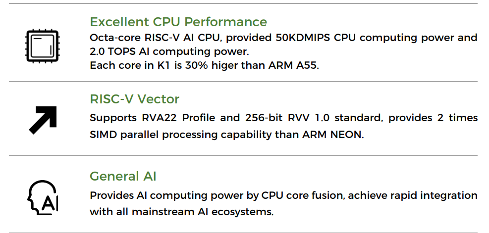
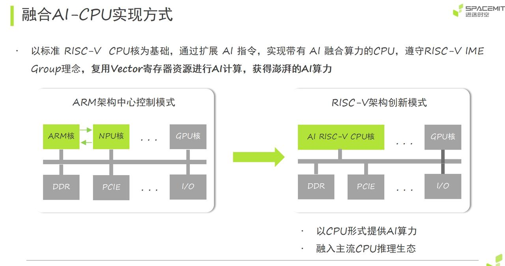
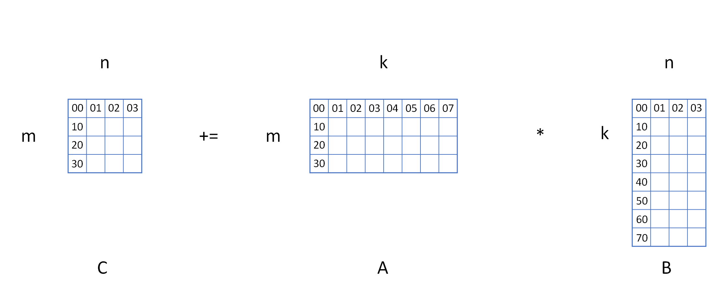
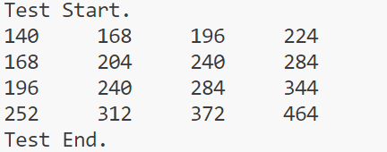
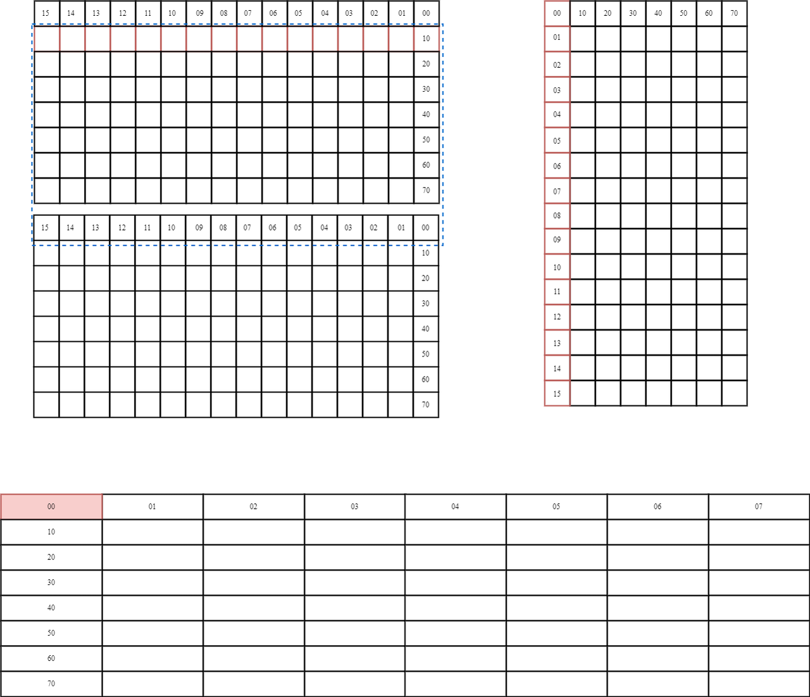
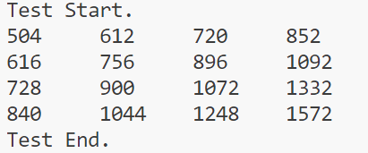

sidebar_position: 4




K1是一款8核RISCV AI-CPU。在RISCV开源指令集的基础上，K1增加了通用AI能力，可以提供50 KDMIPSCPU算力和2.0 TOPS的AI算力。通过将AI算力集成在CPU核内，K1可以实现对所有主流AI生态系统的快速融合。此外，K1支持RISC-V Vector 1.0标准，提供256-bit的向量计算带宽，可以提供2倍于ARM NEON的SIMD并行处理能力。



矩阵乘法是神经网络前向传播和反向传播的基础运算，占深度学习模型计算量的70%以上，尤其是全连接层、卷积层和注意力机制的核心运算单元。在自然语言处理中，通过将单词/短语编码为向量，矩阵乘法可计算语义相似度（如余弦相似度），支撑词嵌入、语义搜索等关键技术。K1中共增加了16条AI指令，包括矩阵乘法指令和滑窗计算。这两类指令支持 无符号相乘，有符号乘无符号，无符号乘有符号，无符号乘无符号4种类型的指令。

# 1 矩阵乘法加速指令（vmadot）

矩阵乘累加指令是AI扩展指令集中最核心的指令，用于加速AI算法中占90%及以上的CONV和GEMM计算。矩阵指令的GEMM参数M/K/N是4/8/4，即输入矩阵（A、B）和输出矩阵(C)的尺寸是：

&#x20;   A: 4 x 8，每个元素8-bit，可以使用编号0~31的VECTOR寄存器

&#x20;   B: 8 x 4，每个元素8-bit，可以使用编号0~31的VECTOR寄存器

&#x20;   C: 4 x 4，每个元素32-bit，可以使用32个VECTOR寄存器中编号为偶数。

## 1.1 **指令功能**



## 1.2 **指令模板**
```asm
vmadot      vd, vs1, vs2    #signed * signed
vmadotu     vd, vs1, vs2    #unsigned * unsigned
vmadotsu    vd, vs1, vs2    #signed * unsigned
vmadotus    vd, vs1, vs2    #unsigned * signed
```

## 1.3 **代码示例**

```c
/***********************Compute Example************************
* MatrixA[4, 8]         x  MatrixB[8, 4]    =   MartrixC[4, 4]
*  [0 1 2 3 4 5  6  7]       [0 1 2 11]           [140 168 196 224] 
*  [1 2 3 4 5 6  7  8]       [1 2 3  4]           [168 204 240 284] 
*  [2 3 4 5 6 7  8  9]       [2 3 4  5]           [196 240 284 344] 
*  [4 5 6 7 8 9 10 11]       [3 4 5  6]           [252 312 372 464] 
*                            [4 5 6  7]
*                            [5 6 7  8]
*                            [6 7 8  9]
*                            [7 8 9 10]
******************************************************/
#include <stdio.h>
#include <stdint.h>

void matmul(const int8_t *A, const int8_t *B, int32_t *C) {
    __asm__ volatile(
        "vsetvli        t0, zero, e8, m1          \n\t"
        "vxor.vv        v16, v0, v0               \n\t"
        "vxor.vv        v17, v0, v0               \n\t"
        "vle8.v         v0, (%[A])                \n\t"
        "vle8.v         v1, (%[B])                \n\t"
        "vmadot         v16, v0, v1               \n\t"
        "vsetvli        t0, zero, e32, m2         \n\t"
        "vse32.v        v16, (%[C])               \n\t"
        : [ A ] "+r"(A), [ B ] "+r"(B), [ C ] "+r"(C)
        :
        : "cc");
}

int main()
{
    printf("Test Start.\n");
    // Init the matrixA, matrixB and matrixC.
    int8_t A[32] = {0, 1, 2, 3, 4, 5, 6, 7,
                    1, 2, 3, 4, 5, 6, 7, 8,
                    2, 3, 4, 5, 6, 7, 8, 9,
                    4, 5, 6, 7, 8, 9, 10, 11};
    int8_t B[32] = {0, 1, 2, 3, 4, 5, 6, 7,
                    1, 2, 3, 4, 5, 6, 7, 8,
                    2, 3, 4, 5, 6, 7, 8, 9,
                    11, 4, 5, 6, 7, 8, 9, 10};
    int32_t C[32] = {0, 0, 0, 0,
                     0, 0, 0, 0,
                     0, 0, 0, 0,
                     0, 0, 0, 0};
    
    // Call the FUNCTION
    matmul(A, B, C);
    
    // Print the OUTPUT
    for(int32_t iter_i=0; iter_i<4; iter_i++){
        for(int32_t iter_j=0; iter_j<4; iter_j++){
            printf("%d \t", C[iter_i*4 + iter_j]);
        }
        printf(" \n");
    }
    printf("Test End.\n");
    return 0;
}
```

**创建文件:** `touch vmadot.c`

**编写代码:** `vi vmadot.c` 将上述代码拷贝到 vmadot.c 文件中

也可直接点击[**下载源代码**](code/chap0405/vmadot.tar.gz), 并解压`tar -xzvf vmadot.tar.gz`

**编译命令:** `gcc -march=rv64gcv vmadot.c -o vmadot`

**运行命令:** `./vmadot`

**输出情况:**




# 2 滑窗计算指令(vmadotN, N为滑动值，可取1，2，3)

卷积运算可以通过整形滑窗乘累加指令进行加速。整形滑窗乘累加指令，可以从vs1和vs1+1两个连续的寄存器中，选取指定的数值。在进行MAC计算的时候，输入及输出数据在寄存器中的排布，输入A会从vs1和vs1+1中选取（vs1下标必须为偶数），选得的元素会被看成M行K列的矩阵，而vs2放输入B，元素会被看成K行N列的矩阵。结果C会放在两个连续的寄存器中（VD(L)的下标必须为偶数），其元素会被看成M行N列的矩阵。当sew=8，vlen=1024，lmul=1为例，排布如下图所示：

## 2.1 **指令功能**


A元素从vs1和vs1+1拼成的2M\*K中选取，并从第0行开始，通过指定的滑动数值选取对应的元素。如上图所示，滑动值为1，蓝框向下滑动(1\*k)个元素。滑动得到的数值，是一个M\*K的矩阵，作为输入矩阵A，参与矩阵乘累加计算。

## 2.2 **指令模板**
```asm
vmadot1     vd, vs1, vs2    #signed * signed
vmadot1u    vd, vs1, vs2    #unsigned * unsigned
vmadot1su   vd, vs1, vs2    #signed * unsigned
vmadot1us   vd, vs1, vs2    #unsigned * signed

vmadot2     vd, vs1, vs2    #signed * signed
vmadot2u    vd, vs1, vs2    #unsigned * unsigned
vmadot2su   vd, vs1, vs2    #signed * unsigned
vmadot2us   vd, vs1, vs2    #unsigned * signed

vmadot3     vd, vs1, vs2    #signed * signed
vmadot3u    vd, vs1, vs2    #unsigned * unsigned
vmadot3su   vd, vs1, vs2    #signed * unsigned
vmadot3us   vd, vs1, vs2    #unsigned * signed
```
## 2.3 **代码示例**

```c
/***********************Compute Example************************
* MatirxA(feature)
*    [0 1 2 3  4  5  6  7]
*    [1 2 3 4  5  6  7  8]
*    [2 3 4 5  6  7  8  9]
*    [4 5 6 7  8  9 10 11]
*    [5 6 7 8  9 10 11 12] 
*    [6 7 8 9 10 11 12 13]
*
*  "vmadot     v16, v0, v8             \n\t"
*  MatrixA[4, 8]：         x  MatrixB[8, 4]    =   MartrixC[4, 4]
*    [0 1 2 3 4 5  6  7]       [0 1 2 11]           [140 168 196 224] 
*    [1 2 3 4 5 6  7  8]       [1 2 3  4]           [168 204 240 284] 
*    [2 3 4 5 6 7  8  9]       [2 3 4  5]           [196 240 284 344] 
*    [4 5 6 7 8 9 10 11]       [3 4 5  6]           [252 312 372 464] 
*                              [4 5 6  7]
*                              [5 6 7  8]
*                              [6 7 8  9]
*                              [7 8 9 10]
*
*  "vmadot1    v16, v0, v8             \n\t"
*  MatrixA[4, 8]：         x  MatrixB[8, 4]  + MartrixC[4, 4]  =  MartrixC[4, 4]
*    [1 2 3 4 5  6  7  8]      [0 1 2 11]           [308 372 436 224] 
*    [2 3 4 5 6  7  8  9]      [1 2 3  4]           [364 444 524 628] 
*    [4 5 6 7 8  9 10 11]      [2 3 4  5]           [448 552 656 808] 
*    [5 6 7 8 9 10 11 12]      [3 4 5  6]           [532 660 788 988] 
*                              [4 5 6  7]
*                              [5 6 7  8]
*                              [6 7 8  9]
*                              [7 8 9 10]
*
*  "vmadot2     v16, v0, v8            \n\t"
* MatrixA[4, 8]：         x  MatrixB[8, 4]  + MartrixC[4, 4]   =   MartrixC[4, 4]
*    [2 3 4 5 6  7  8   9]     [0 1 2 11]           [504  612  720  852] 
*    [4 5 6 7 8  9  10 11]     [1 2 3  4]           [616  756  896 1092] 
*    [5 6 7 8 9  10 11 12]     [2 3 4  5]           [728  900 1072 1332] 
*    [6 7 8 9 10 11 12 13]     [3 4 5  6]           [840 1044 1248 1572] 
*                              [4 5 6  7]
*                              [5 6 7  8]
*                              [6 7 8  9]
*                              [7 8 9 10]
******************************************************/
#include <stdio.h>
#include <stdint.h>

void vmadotN(const int8_t *feature, const int8_t *weight, int32_t *output) {
    __asm__ volatile(
        "vsetvli    t0, zero, e8, m1        \n\t"
        "vxor.vv    v16, v0, v0             \n\t"
        "vxor.vv    v17, v0, v0             \n\t"
        "vle8.v     v0, (%[A])              \n\t"
        "addi       %[A], %[A], 4*8         \n\t"
        "vle8.v     v1, (%[A])              \n\t"
        "addi       %[A], %[A], 4*8         \n\t"
        "vle8.v     v8, (%[B])              \n\t"
        "addi       %[B], %[B], 4*8         \n\t"
        "vmadot     v16, v0, v8             \n\t"
        "vmadot1    v16, v0, v8             \n\t"
        "vmadot2    v16, v0, v8             \n\t"
        "vsetvli    t0, zero, e32, m2       \n\t"
        "vse32.v    v16, (%[C])             \n\t"
        
        : [A] "+r"(feature), [ B ] "+r"(weight), [ C ] "+r"(output)
        :
        : "cc");
}

int main()
{
    printf("Test Start.\n");
    // Init the matrixA, matrixB and matrixC.
    int8_t A[64] = {0, 1, 2, 3,  4,  5,  6,  7,
                    1, 2, 3, 4,  5,  6,  7,  8,
                    2, 3, 4, 5,  6,  7,  8,  9,
                    4, 5, 6, 7,  8,  9, 10, 11,
                    5, 6, 7, 8,  9, 10, 11, 12,
                    6, 7, 8, 9, 10, 11, 12, 13,
                    0, 0, 0, 0,  0,  0,  0,  0,
                    0, 0, 0, 0,  0,  0,  0,  0};
    int8_t B[32] = {0, 1, 2, 3, 4, 5, 6, 7,
                    1, 2, 3, 4, 5, 6, 7, 8,
                    2, 3, 4, 5, 6, 7, 8, 9,
                    11, 4, 5, 6, 7, 8, 9, 10};
    int32_t C[32] = {0, 0, 0, 0,
                     0, 0, 0, 0,
                     0, 0, 0, 0,
                     0, 0, 0, 0};
    
    // Call the FUNCTION
    vmadotN(A, B, C);
    
    // Print the OUTPUT
    for(int32_t iter_i=0; iter_i<4; iter_i++){
        for(int32_t iter_j=0; iter_j<4; iter_j++){
            printf("%d \t", C[iter_i*4 + iter_j]);
        }
        printf(" \n");
    }
    printf("Test End.\n");
    return 0;
}
```

**创建文件:** `touch vmadotN.c`

**编写代码:** `vi vmadotN.c` 将上述代码拷贝到 vmadotN.c 文件中

也可直接点击[**下载源代码**](code/chap0405/vmadotN.tar.gz), 并解压`tar -xzvf vmadotN.tar.gz`

**编译命令:** `gcc -march=rv64gcv vmadotN.c -o vamdotN`

**运行命令:** `./vamdotN`

**输出情况:**



