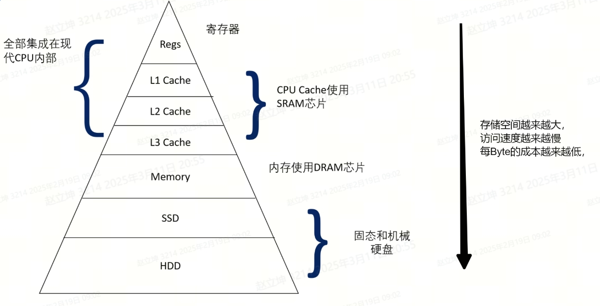
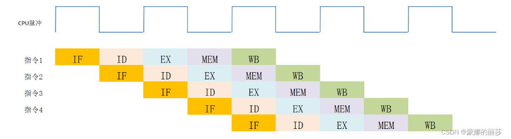
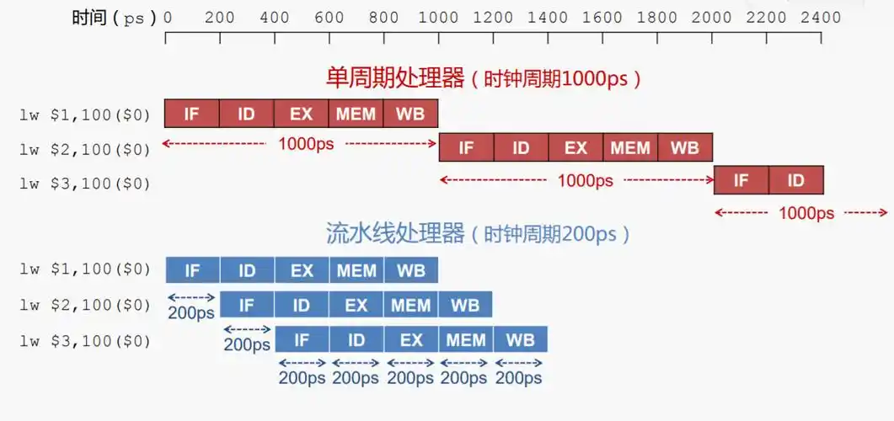
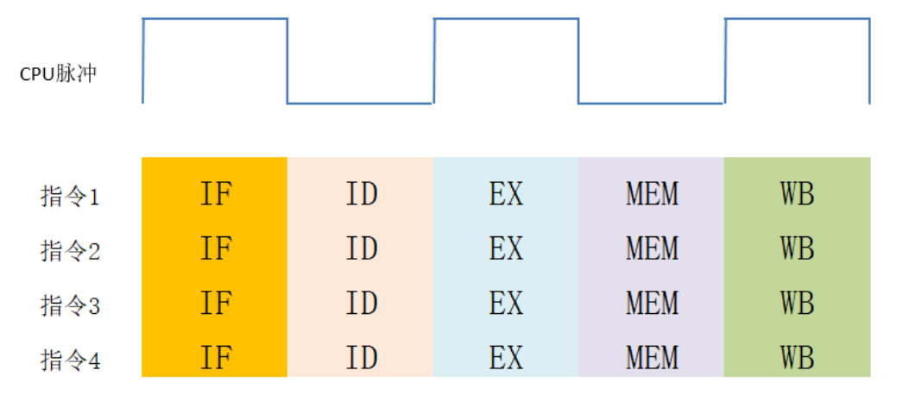

# 1 访存

访存层级，简而言之，是指计算机存储系统中所形成的层次结构。这一结构从高速但容量有限的寄存器开始，逐渐过渡到容量更大但速度较慢的缓存（如L1、L2、L3缓存），再到主存（RAM），最后到达大容量但访问速度最慢的辅助存储器（如硬盘或SSD）。这种层级设计旨在平衡存储器的速度与容量，通过利用数据访问的局部性原理，使得常用数据能尽可能存储在高速缓存中，从而显著提高程序的执行效率。

## 1.1 访存过程

访存层级的访问过程主要涉及CPU如何通过不同层次的存储器系统访问所需的数据。这个过程通常包括虚实地址转换, 访问cache, 访问主存等步骤。

## 1.1.1. 虚实地址转换

   1) **获取物理地址**

程序员在编程时使用的是逻辑地址，这些地址是虚拟的，需要转换成物理地址才能找到数据实际存放的位置。

   2) **访问TLB**

TLB（Translation Lookaside Buffer，转换旁路缓冲器）是一种特殊的存储器，用于快速地址转换。它存储了最近访问的页表条目，以加速地址转换过程。当CPU需要访问某个地址时，首先会检查TLB中是否有该地址的映射信息。如果TLB命中（TLB Hit），即找到了对应的映射信息，则直接使用TLB中的物理地址进行访问; 如果TLB未命中（TLB Miss），CPU则需要**访问页表**进行地址转换。

   3) **访问页表**：

页表是操作系统维护的一个数据结构，它存储了逻辑地址到物理地址的映射关系。CPU在页表中找到对应的页表项后，会检查有效位来确定该页面是否在物理内存中。如果有效位为1，表示数据在主存中，CPU可以继续访问主存以获取数据; 如果有效位为0，表示数据不在主存中，即发生了**缺页异常**(Page Fault)。

   4) **处理缺页异常**：

当发生缺页异常时，操作系统会调用缺页异常处理程序来处理这一异常。操作系统会确定辅存中数据的位置，并通过页面置换算法选择一个页面进行置换。然后，操作系统从辅存中加载缺失的数据到主存，并更新页表以反映新的物理地址映射。页表更新后，操作系统会重新执行导致缺页异常的指令。

## 1.1.2. **访问Cache-主存体系**

   1) **访问Cache**：

在得到物理地址后，CPU会尝试访问Cache以获取数据。如果Cache命中（Cache Hit），即Cache中存储了所需的数据，则CPU直接从Cache中读取数据，完成访存操作; 如果Cache未命中（Cache Miss），即Cache中没有存储所需的数据，CPU则需要**访问主存**来获取数据。

   2) **访问主存**：

在访问主存之前，如果数据块不在Cache中，CPU可能会先将该数据块从主存调入Cache，以便后续快速访问。然后，CPU从主存中读取所需的数据，并可能将其同时存入Cache中（取决于Cache的写入策略）。

## 1.2 存储层次结构的作用

存储层次结构的设计是为了在成本、容量、速度和访问时间之间取得平衡。高层存储器（如Cache）速度快但容量小，适合存储频繁访问的数据。低层存储器（如主存、辅存）容量大但速度慢，适合存储不频繁访问的数据。通过层次化的存储结构，可以在保证大容量存储的同时，提高存储器的平均访问速度。下图被称为存储器金字塔。从上到下，存储空间越来越大，单位空间的成本越来越低，速度越来越慢。

# 2 流水线

## 2.1 流水线技术

### 2.1.1 定义

流水线技术，则是为了提高计算机指令的执行速度而采用的并行处理技术。它将**一条指令的执行过程分解为多个阶段**，如取指、译码、执行、访存、写回等，并使这些阶段在不同的指令之间重叠进行。这样，当一条指令在执行某一阶段时，下一条指令可以开始其前一个阶段的处理。流水线技术通过同时处理多条指令的不同部分，显著提升了计算机的吞吐量，使得单位时间内能够完成更多指令的执行。

### 2.1.2 技术原理与特点

* 指令分解：在流水线技术中，一条指令被分解为多个子过程，如取指、译码、执行、访存和写回等。这些子过程在时间上重叠进行，前一个子过程为下一个子过程创造执行条件。

* 并行处理：通过流水线技术，多条指令可以在不同的阶段并行执行。这样，即使单条指令的执行需要多个时钟周期，但整体上处理器仍然可以在每个时钟周期内完成一条或多条指令的部分工作，从而提高了指令的吞吐量。

* 硬件电路协同：流水线技术的实现依赖于多个硬件电路的协同工作。每个阶段都有专门的电路负责处理相应的任务，如取指单元负责从内存中取出指令，译码单元负责解析指令，执行单元负责执行指令等。

### 2.1.3 流水线技术的分类

流水线技术可以根据不同的标准进行分类，主要包括：

1) 按处理级别分类：

* 操作部件级流水线：在实现较为复杂的运算时采用。

* 指令级流水线：将一条指令执行过程分为多个阶段，如取指、译码、执行、写回等。

* 处理机级流水线：每个处理器完成其专门的任务，如多核处理器中的每个核心可以看作是一个处理机级流水线。

   

   

2) 按功能分类：

* 单功能流水线：只完成一种功能，如乘法或浮点运算等。

* 多功能流水线：在不同情况下可完成不同功能。

3) 按连接方式分类：

* 线性流水线：指各功能模块顺序串行连接，无反馈回路。

* 非线性流水线：带有反馈回路的流水线。

### 2.1.4 流水线技术的性能指标

衡量流水线技术性能高低的指标主要包括吞吐率、加速比和效率。

* 吞吐率：指流水线在特定的时间内可以处理的任务或输出数据的结果的数量。吞吐率可以进一步分为最大吞吐率和实际吞吐率，它们主要和流水段的处理时间、缓存寄存器的延迟时间有关。

* 加速比：指某一流水线如果采用串行模式之后所用的时间T0和采用流水线模式后所用时间T的比值。数值越大，说明这条流水线的工作安排方式越好。

* 效率：指流水线中各个部件的利用率。由于流水线在开始工作时存在建立时间，在结束时存在排空时间，因此各个部件不可能一直在工作。用处于工作状态的部件和总部件的比值来说明这条流水线的工作效率。

### 2.1.5 流水线技术面临的挑战与优化策略

尽管流水线技术带来了诸多优势，但也面临着一些挑战，如数据冲突（数据冒险）、分支预测（控制冒险）以及硬件成本等。为了克服这些挑战并进一步提升CPU性能，可以采取以下优化策略：

1) 寄存器重命名：通过为寄存器重新命名来避免数据冲突。

2) 动态分支预测：采用更先进的分支预测算法来提高预测的准确性。

3) 优化流水线深度：根据实际需求合理设计流水线的深度，以平衡吞吐量和硬件成本。

### 2.1.6 流水线技术的应用与前景

流水线技术已经广泛应用于现代CPU中，成为提升CPU性能的重要手段之一。随着半导体制造工艺的不断进步和计算机体系结构的持续优化，未来的CPU将会采用更加先进的流水线技术，实现更高的性能和更低的功耗。例如，超级流水线、超标量流水线以及非线性超流水线等技术将进一步推动CPU性能的提升。

## 2.2 超流水线技术

### 2.2.1 定义

超流水线技术是通过细化流水、提高主频，使得机器在一个周期内能够完成一个甚至多个操作的技术。其实质是用空间换取时间，通过增加流水线的级数来提高处理器的指令处理能力。

### 2.2.2 特点

1) 多级流水线：超流水线处理器内部的流水线级数通常超过通常的5\~6步以上，例如Pentium Pro的流水线就长达14步。更多的流水线级数意味着处理器能够在更短的时间内完成一条指令的处理。

2) 并行执行：超流水线处理器能够在同一个时钟周期内同时发射和执行多条指令，这大大提高了处理器的指令吞吐量。

3) 功能单元并行：为了支持多条指令并行执行，超流水线处理器配备了多个功能单元，如多个算术逻辑单元（ALU）、浮点单元、访存单元等。这些单元独立运行，可以同时处理不同的运算、访存或其他任务。

### 2.2.3 工作原理

超流水线处理机采用把“取指令”、“译码”、“执行”和“写回结果”等功能段进一步细分的方法，把一个功能段分为几个流水级，或者说把一个时钟周期细分为多个流水线周期。由于每一个流水线周期可以发射一条指令，因此每一个时钟周期就能够发射并执行完成多条指令。这种设计充分利用了时间并行性，在同一个操作部件上重叠多个操作，从而加快了程序的执行速度。

## 2.3 超标量流水线

### 2.3.1 定义与基本概念

超标量流水线技术是指在处理器中设计有**多条指令流水线，使得在每个时钟周期内能够同时执行多条指令**。这种技术通过并行处理指令，提高了处理器的吞吐量，从而提升了整体性能。

### 2.3.2 技术原理与特点

1) 并行处理：超标量处理器配备了多个处理单元，用于在每个处理阶段并行处理各种指令。这些处理单元可以同时工作，实现指令的并行执行。

2) 动态指令调度：超标量处理器在指令执行时，会根据资源、数据相关等情况，动态地决定是否并行执行指令。这种动态调度技术能够优化指令的执行顺序，提高处理器的效率。

3) 多条流水线结构：超标量处理器内部集成了多条指令流水线，这些流水线可以同时工作，使得在每个时钟周期内能够完成一条以上的指令。这种设计增加了处理器的并行处理能力。

### 2.3.3 超标量流水线的实现方式

1) 并行寄存器重命名：为了避免指令之间的数据依赖关系导致的流水线停顿，超标量处理器采用了并行寄存器重命名技术。这种技术能够为指令分配不同的寄存器，从而消除数据依赖关系，使指令能够并行执行。

2) 并行指令解码：超标量处理器具有并行指令解码能力，能够同时解码多条指令。这种解码方式提高了指令的处理速度，使得处理器能够更快地执行指令。

3) 乱序执行：为了进一步优化指令的执行顺序，超标量处理器采用了乱序执行技术。这种技术能够打乱指令的执行顺序，将不相关的指令插入到相关指令之间，从而避免流水线的停顿和等待。

4) 推测执行：超标量处理器还采用了推测执行技术，即在没有得到指令执行结果之前，根据预测的结果提前执行下一条指令。这种技术能够进一步提高处理器的性能，但一旦预测错误，需要清理整条流水线并回到分支点，因此存在一定的风险。

### 2.3.4 超标量流水线的应用与优势

1) 提高处理器性能：通过并行处理指令和动态调度技术，超标量流水线技术能够显著提高处理器的性能。这使得处理器能够更快地执行复杂的计算任务，提高了系统的整体性能。

2) 支持多线程处理：超标量流水线技术能够支持多线程处理，使得处理器能够同时处理多个线程的任务。这种能力提高了系统的并发处理能力，使得系统能够更高效地处理多个任务。

3) 优化资源利用：超标量流水线技术通过并行处理和动态调度技术，能够优化处理器的资源利用。这使得处理器能够更充分地利用硬件资源，提高了系统的整体效率。

