sidebar_position: 6

# 1. 数组最大值


在工业控制系统与实时数据处理场景中，**数组最大值计算**是核心需求之一。例如，在伺服电机控制或多传感器数据采集中，系统需实时监测温度、压力等参数，快速筛选异常值以触发预警或控制指令。传统标量实现通过逐元素循环比较实现，但循环中的分支指令（如条件判断）易导致流水线停顿，且频繁的内存访问加剧延迟。RISC-V向量扩展（RVV）的引入，通过单条指令（如`vmax`）对多个元素并行计算，显著减少指令数量并提升吞吐量。

## 1.1 标量版本代码

````c
void max_data_c(float *src, float *dst, size_t len) {
  float result = src[0];
  for (int ii = 1; ii < len; ii++) {
    if(src[ii] > result)
    result = src[ii];
  }
  *dst = result;
}
````

## 1.2 优化思路分析

假设我们的VLEN=256b，SEW=32b，则每个向量最多可以存放8个元素，我们要处理的数据是长度为len的大小为32位的单精度浮点数。数据是一维布局如下图所示：


第1步：因为数组总长度是任意正整数，所以先将src\[0]内元素，广播到v0中，将index初始化为1。

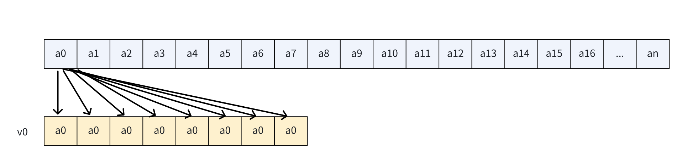

第2步：加载从index开始的一批数据到v1中。

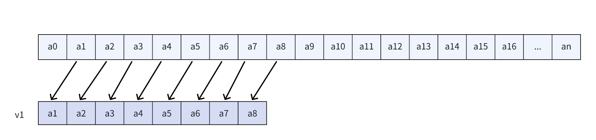

第3步：使用vfmax.vv指令，对v0和v1逐个进行比较，取两者中的最大值，分别标记为c1、c2、c3、...、c7，并将结果存入v0中。


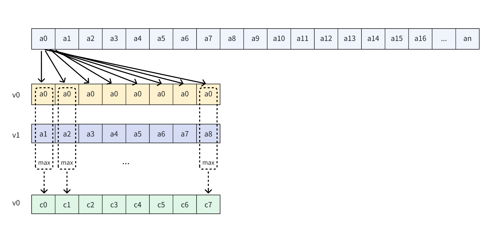

第4步：更新index的值为(index+ 8),若还有元素没有处理完，则回到第2步;否则执行第5步。


第5步：使用 vfredmax.vs 指令，获取 v0 内 t0 个元素中的最大值，即d0 = max(c0,c1,c2...c7)。
 
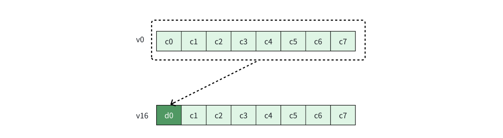

第6步：将结果存到目标位置。

````c
                   "vfmv.f.s            ft1, v16                    \n\t"
                   "fsw                 ft1, 0(t2)                  \n\t"
````

## 1.3 向量化版本代码（VLEN=32b, SEW=32b，LMUL=8）

````c
void max_data_riscv(float *src, float *dst, size_t len) {
  float result = src[0];
  len -= 1;
  __asm__ volatile(
                   "mv                  t1, %[in]                   \n\t"
                   "mv                  t2, %[dst]                  \n\t"
                   "vsetvli             t0, zero, e32, m8           \n\t"
                   "vfmv.v.f            v0, %[result]               \n\t"
                   "mv                  t4, %[len]                  \n\t"
                   "LOOPWBODY%=:                                    \n\t"
                   "vsetvli             t0, t4, e32, m8             \n\t"
                   "sub                 t4, t4, t0                  \n\t"
                   "vle32.v             v8, (t1)                    \n\t"
                   "sll                 t5, t0, 2                   \n\t"
                   "add                 t1, t1, t5                  \n\t"
                   "vfmax.vv            v0, v8, v0                  \n\t"
                   "bnez                t4, LOOPWBODY%=             \n\t"
                   "vfredmax.vs         v16, v0, v0                 \n\t"
                   "vfmv.f.s            ft1, v16                    \n\t"
                   "fsw                 ft1, 0(t2)                  \n\t"
                   :  [dst] "+r"(dst)
                   : [len] "r"(len), [result] "f"(result), [in] "r"(&src[1])
                   : "cc", "t0", "t1", "t2", "t3", "t4", "t5");
}
````

## 1.4 优化效果

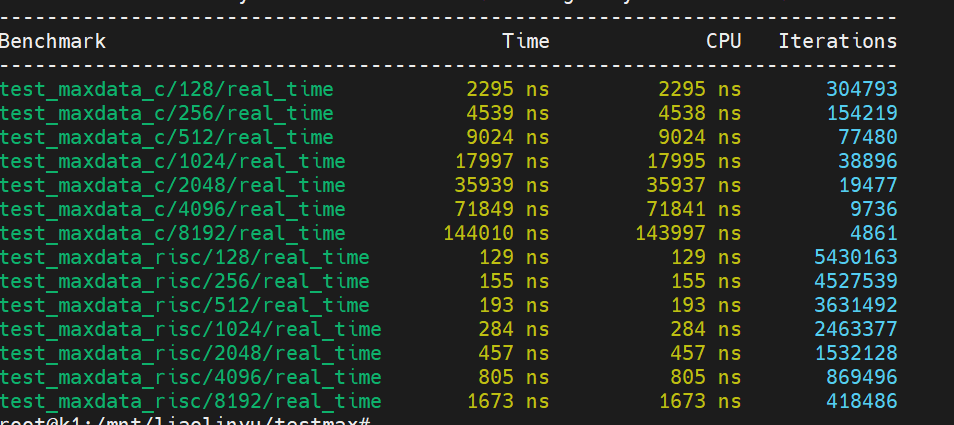

最高加速比达89.25！


# 2. 数据融合优化

**数据融合**在物联网与边缘计算场景中至关重要。例如，智能设备需实时融合温湿度、光照等多源传感器数据，生成环境感知结果以驱动决策。传统实现通过逐元素相加或加权计算，但频繁的标量加载-计算-存储操作导致内存带宽瓶颈，尤其在小规模数据场景下，固定开销占比显著。RISC-V的向量化优化通过**连续内存访问**与**指令融合**提升效率。

## 2.1 标量版本代码

````c
void image_datafusion_c(float *src, float *dst, size_t len) {
  float result = 0;
  for (int ii = 0; ii < len; ii++) {
    result += src[ii];
  }
  *dst = result;
}
````

## 2.2 优化思路分析

假设我们的VLEN=256b，SEW=32b，则每个向量最多可以存放8个元素，我们要处理的数据是长度为len的大小为32位的单精度浮点数。数据是一维布局如下图所示：

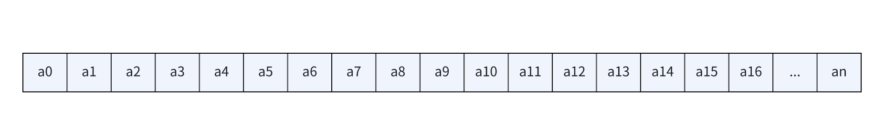

第1步：将v0初始化为全零的向量，将index初始化为0。


第2步：加载从index开始的一批数据到v1中。


第3步：使用 vfredosum 指令计算和。


第4步：更新 index 的值为(index + 8),若还有元素没有处理完，则回到第2步，否则执行第5步：

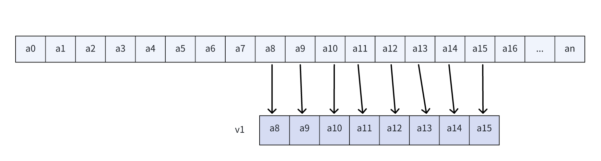

第5步：将结果存到目标位置：

````c
                   "vfmv.f.s            ft1, v0                     \n\t"
                   "fsw                 ft1, 0(t2)                  \n\t"
````

## 2.3 向量化版本代码（VLEN=32b, SEW=32b，LMUL=8）

````c
void image_datafusion_riscv(float *src, float *dst, size_t len) {
  float result = 0;
  __asm__ volatile(
                   "mv                  t1, %[in]                   \n\t"
                   "mv                  t2, %[dst]                  \n\t"
                   "vsetvli             t0, zero, e32, m8           \n\t"
                   "mv                  a7, zero                    \n\t"
                   "fcvt.s.w            fa5, a7                     \n\t"
                   "vfmv.v.f            v0, fa5                     \n\t"
                   "mv                  t4, %[len]                  \n\t"
                   "LOOPWBODY%=:                                    \n\t"
                   "vsetvli             t0, t4, e32, m8             \n\t"
                   "sub                 t4, t4, t0                  \n\t"
                   "vle32.v             v8, (t1)                    \n\t"
                   "sll                 t5, t0, 2                   \n\t"
                   "add                 t1, t1, t5                  \n\t"
                   "vfredosum.vs        v0, v8, v0                  \n\t"
                   "bnez                t4, LOOPWBODY%=             \n\t"
                   "vfmv.f.s            ft1, v0                     \n\t"
                   "fsw                 ft1, 0(t2)                  \n\t"
                   : [in] "+r"(src), [dst] "+r"(dst)
                   : [len] "r"(len)
                   : "cc", "t0", "t1", "t2", "t3", "t4", "t5");
}
````

## 2.4 优化效果

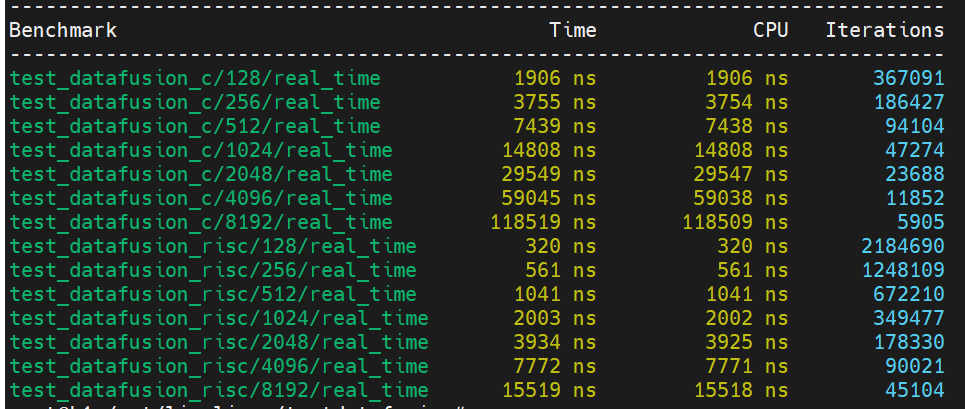

# 3. **Threshold Filter**

**Threshold Filter**广泛应用于图像处理、信号降噪等场景。例如，在边缘检测中需快速过滤高于阈值的噪声像素，或在工业检测中提取有效信号。传统实现依赖条件分支逐元素判断，但分支预测失败会导致流水线清空，严重降低性能。RISC-V向量化通过**掩码操作**消除分支：向量比较指令（如`vmsge`）生成掩码标记有效元素，随后通过`vmerge`指令选择性保留数据，其余位置填零。此方法将条件逻辑转换为数据并行操作，显著提升吞吐量。

## 3.1 标量版本代码

````c
void threshold_filter_c(float *src, float *dst, float threshold, size_t len) {
  for (int ii = 0; ii < len; ii++) {
    dst[ii] = src[ii] > threshold ? src[ii] : 0;
  }
}
````

## 3.2 优化思路分析

假设我们的VLEN=256b，SEW=32b，则每个向量最多可以存放8个元素，我们要处理的数据是长度为len的大小为32位的单精度浮点数。数据是一维布局如下图所示：


第1步：将v1初始化为全阈值的向量，将index初始化为0。


第2步：加载从index开始的一批数据到v1中。

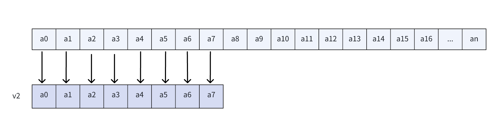

第3步：让v1与v2进行比较，生成掩码，（只能）存放在v0中。v0内的每个元素的值，都是标记了v2对应位置的数值是否小于阈值x， 标记为d0、d1、d2、... 、d7。

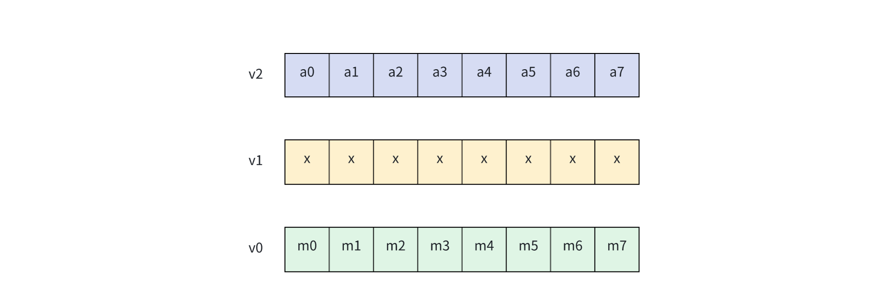

第4步：根据v0中的掩码，对v2和常数0.0f 进行 merge出目标值，存放在v2中。

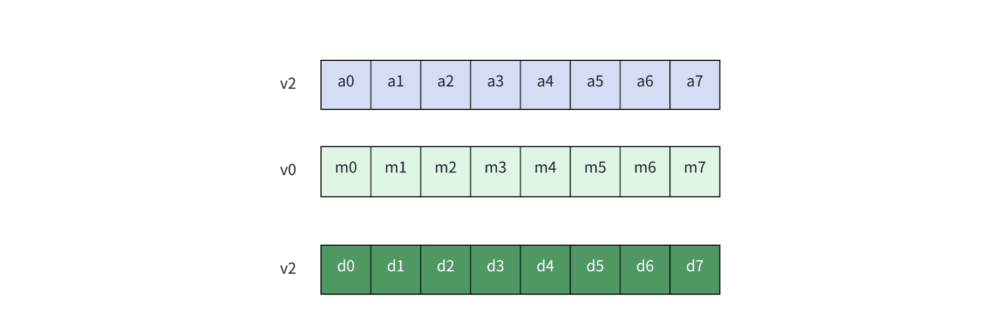

对应如下代码，其中 fa5值为0，上图中 d\[i] = m\[i] ？fa5 : a\[0]。

````c
"vfmerge.vfm         v2, v2, fa5, v0            \n\t"
````

第5步：将结果存在目标地址，并更新目标地址。

第6步：更新 index 的值为(index + 8),若还有元素没有处理完，则回到第2步，否则执行结束。

## 3.3 向量化版本代码（VLEN=32b, SEW=32b，LMUL=8）

````c
void threshold_filter_riscv(float *src, float *dst, float threshold, size_t len) {
  float result = 0;
  __asm__ volatile(
                   "mv                  t1, %[in]                   \n\t"
                   "mv                  t2, %[dst]                  \n\t"
                   "vsetvli             t0, zero, e32, m8           \n\t"
                   "mv                  a7, zero                    \n\t"
                   "fcvt.s.w            fa5, a7                     \n\t"
                   "vfmv.v.f            v8, fa5                     \n\t"
                   "vfmv.v.f            v16, %[threshold]           \n\t"
                   "mv                  t4, %[len]                  \n\t"
                   "LOOPWBODY%=:                                    \n\t"
                   "vsetvli             t0, t4, e32, m8             \n\t"
                   "sub                 t4, t4, t0                  \n\t"
                   "vle32.v             v24, (t1)                   \n\t"
                   "sll                 t5, t0, 2                   \n\t"
                   "add                 t1, t1, t5                  \n\t"
                   "vmflt.vv            v0, v24, v16                \n\t"
                   "vfmerge.vfm         v8, v24, fa5, v0            \n\t"
                   "vle32.v             v8, (t2)                    \n\t"
                   "add                 t2, t2, t5                  \n\t"
                   "bnez                t4, LOOPWBODY%=             \n\t"
                   : [in] "+r"(src), [dst] "+r"(dst)
                   : [len] "r"(len), [threshold]  "f"(threshold)
                   : "cc", "t0", "t1", "t2", "t3", "t4", "t5");
}
````

## 3.4 优化效果

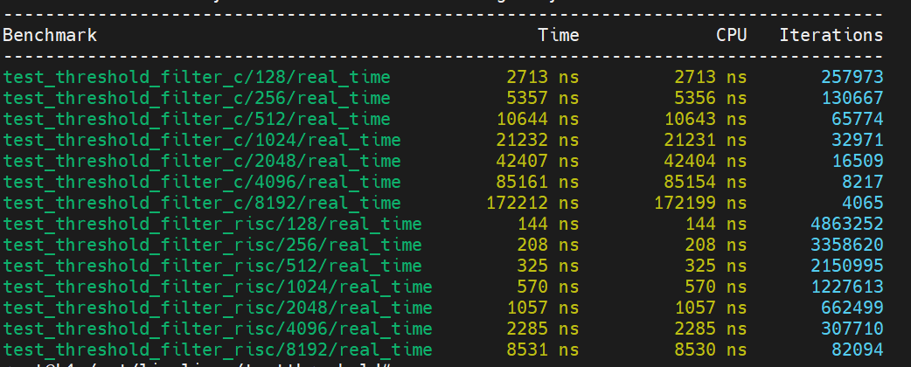

# 4. 小结

在一维数据的应用场景中，一般就是在唯一的一个维度上进行向量化处理，再根据实际的计算需求，为其匹配指令集中最佳的指令。

# 5. 代码及编译

[下载源代码](code/chap0607/riscv-1D2D-examples.tar),并解压

编译并运行

````c
cd 测试项名称 # 例如 cd Sobel
mkdir build
cd build
cmake ../ -DCMAKE_TOOLCHAIN_FILE=../../linux_riscv64.toolchain.cmake
make
../run.sh main_test
````
