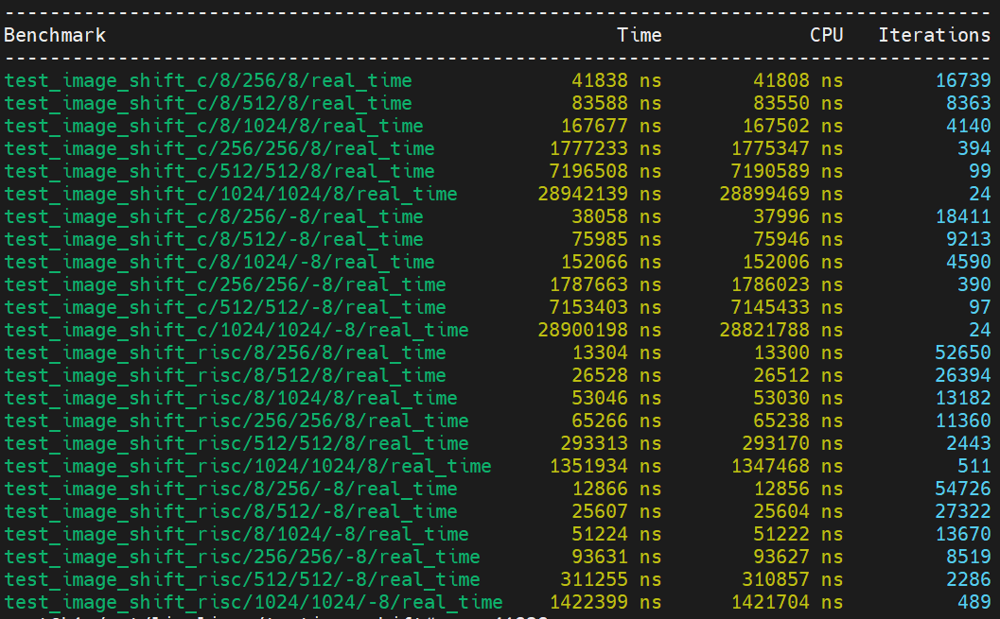
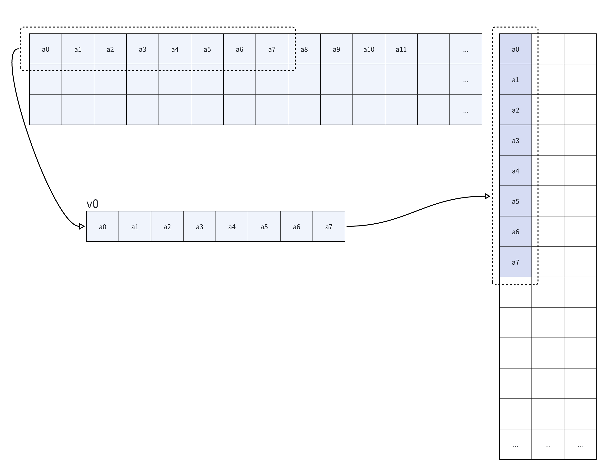
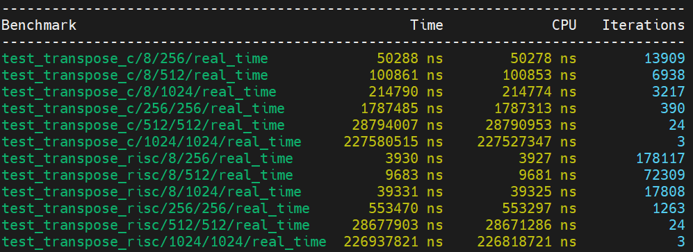
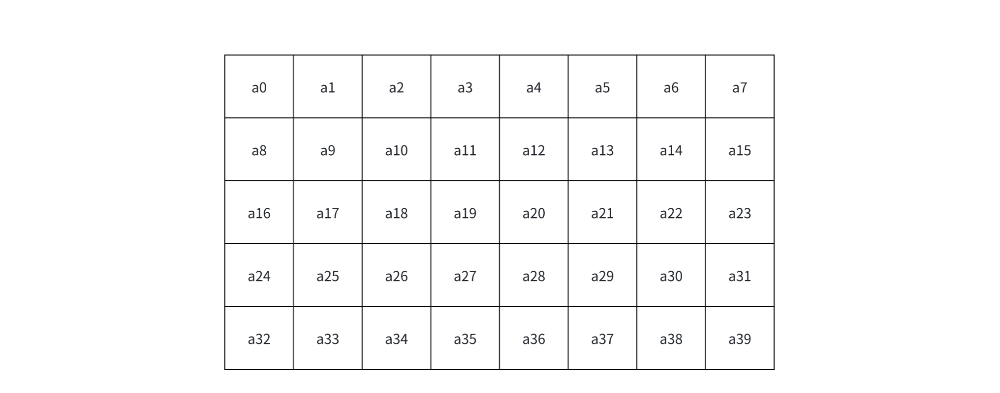
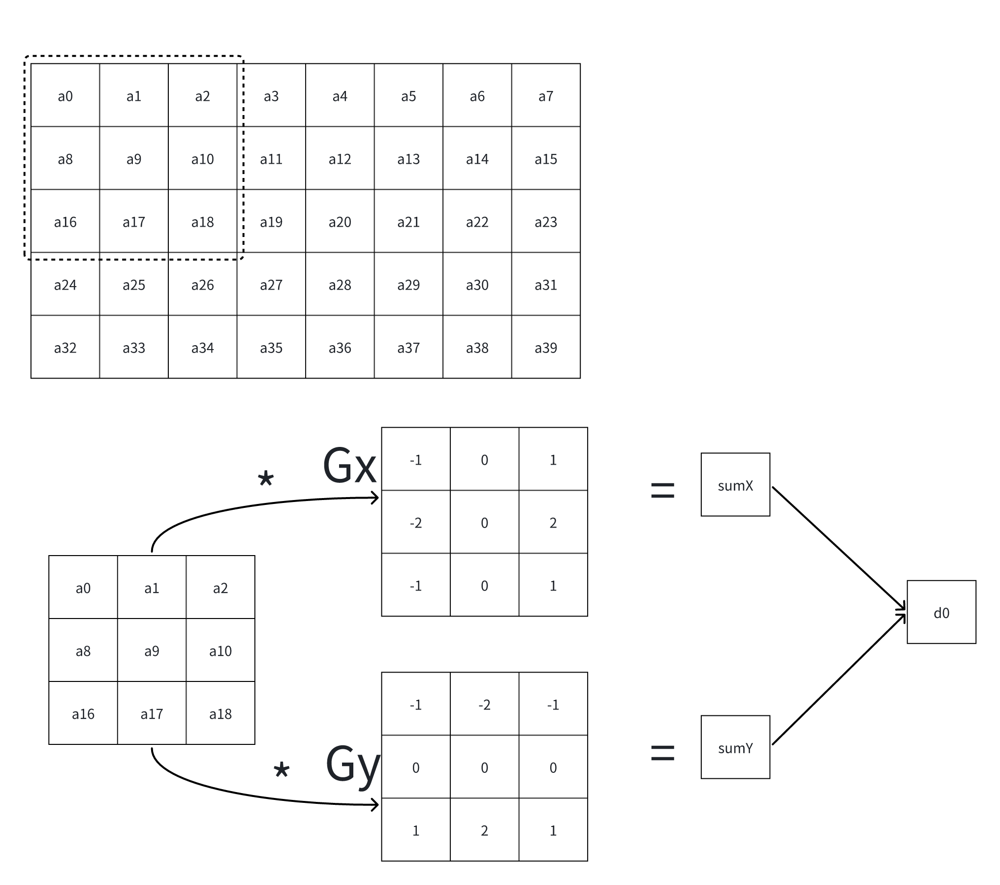
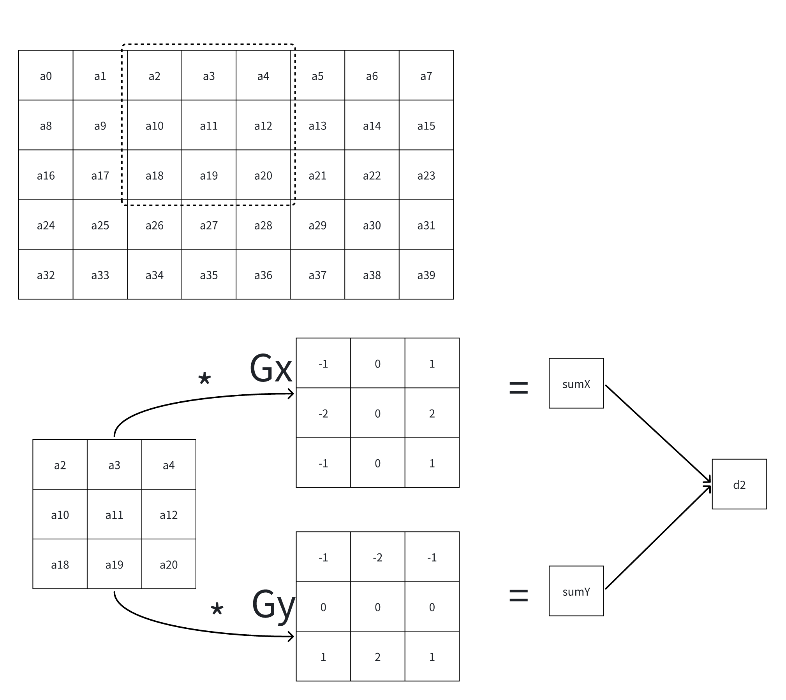
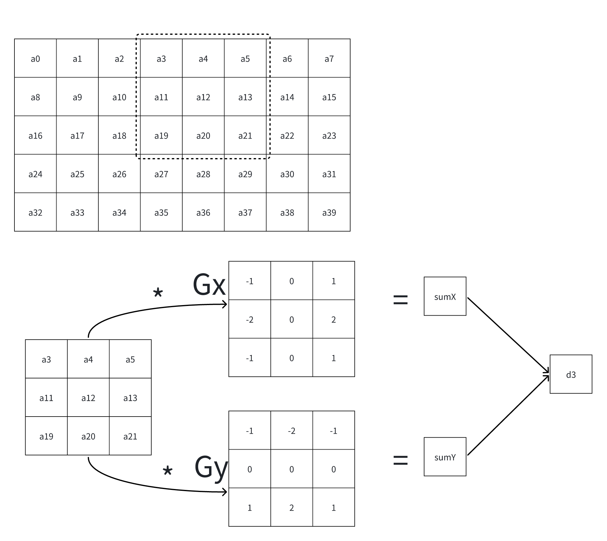
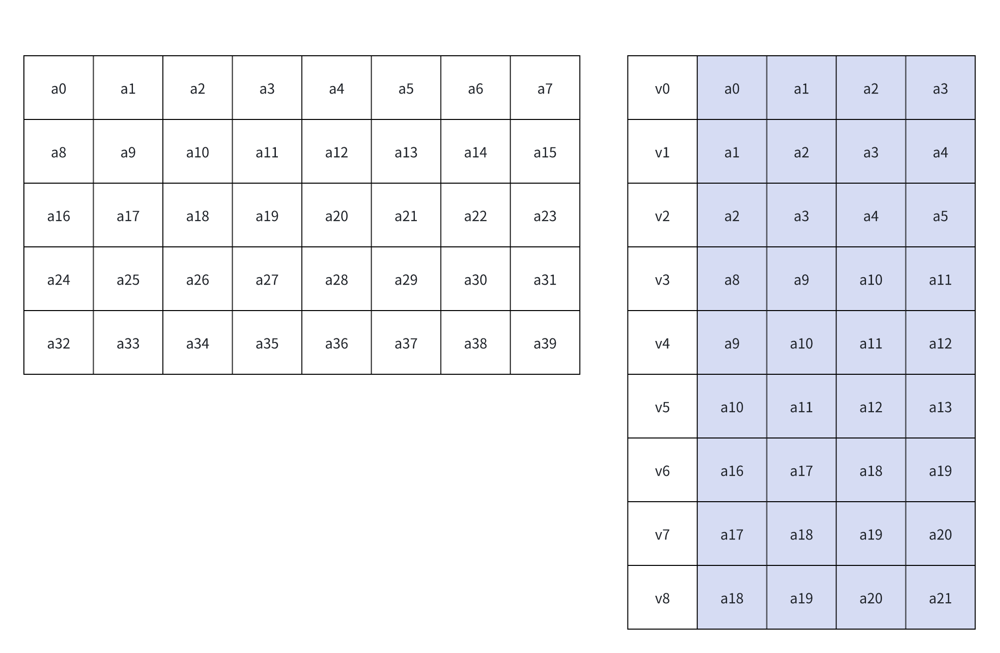
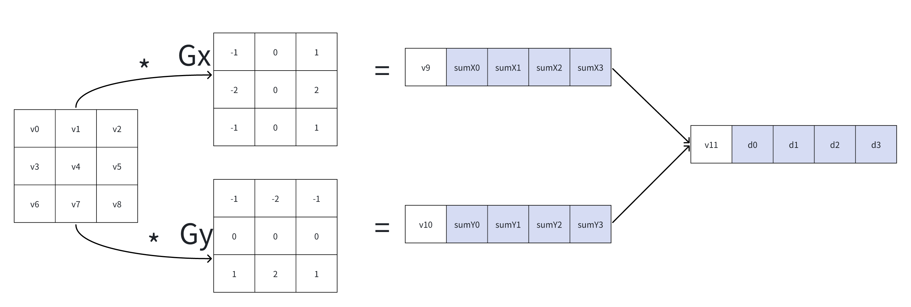
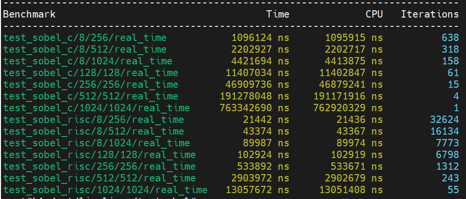

sidebar_position: 7

# 1. 图像平移

图像平移广泛应用于监控视频分析、机器人视觉、增强现实和图像修复等领域，图像平移是图像处理中的一种基本操作，通过对图像每个像素的坐标进行平移变换，可以实现对图像的“平移”效果。这种操作常用于视觉系统中的目标跟踪、运动检测等场景。在RISC-V架构中，图像平移的优化可以通过精细的指令集和寄存器操作来提高计算效率，尤其在嵌入式设备中，由于资源有限，优化至关重要。利用并行处理的特性，可以将图像的每一行或每一列的平移操作分配到不同的处理单元，显著减少处理时间。

## 1.1 标量版代码
````c
void image_shift_c(float *src, float *dst, size_t width, size_t height, int shift) {
  int left = 0;
  int right = width;
  if (shift < 0) {
    right = width + shift;
  }
  if (shift > 0) {
    left = shift;
  }
  for (int h = 0; h < height; h++) {
    for (int w = 0; w < left; w++) {
      dst[h * width + w] = 0;
    }
    for (int w = left; w < right; w++) {
      dst[h * width + w] = src[h * width + w - left];
    }
    for (int w = right; w < width; w++) {
      dst[h * width + w] = 0;
    }
  }
}
````

## 1.2 优化思路分析

图像水平移动并补零，那么图像可能往左移动，也可能往右移动，所以在水平方向，可能是左侧需要补零，也可能是右侧补零，但中间一定是填充原本图像的内容，所以把这三种情况，在水平上进行向量化的load/store就行。

## 1.3 向量化代码

````c
void image_shift_riscv(float *src, float *dst, size_t width, size_t height, int shift) {
  int left = 0;
  int right = width;
  if (shift < 0) {
    right = width + shift;
  }
  if (shift > 0) {
    left = shift;
  }
  size_t len0 = left;
  size_t len1 = right - left;
  size_t len2 = width - right;
  size_t src_offset = width * sizeof(float);
  __asm__ volatile(
                   "vsetvli             t0, zero, e32, m8           \n\t"
                   "mv                  a7, zero                    \n\t"
                   "fcvt.s.w            fa5, a7                     \n\t"
                   "vfmv.v.f            v0, fa5                     \n\t"
                   "mv                  t3, %[src_offset]           \n\t"
                   "mv                  t2, %[dst]                  \n\t"
                   "LOOPH%=:                                        \n\t"
                   "mv                  t1, %[in]                   \n\t"
                   "mv                  t4, %[len0]                 \n\t"
                   "LOOPWLEFT%=:                                    \n\t"
                   "vsetvli             t0, t4, e32, m8             \n\t"
                   "sub                 t4, t4, t0                  \n\t"
                   "sll                 t5, t0, 2                   \n\t"
                   "vse32.v             v0, (t2)                    \n\t"
                   "add                 t2, t2, t5                  \n\t"
                   "bnez                t4, LOOPWLEFT%=             \n\t"
                   "mv                  t4, %[len1]                 \n\t"
                   "LOOPWBODY%=:                                    \n\t"
                   "vsetvli             t0, t4, e32, m8             \n\t"
                   "sub                 t4, t4, t0                  \n\t"
                   "vle32.v             v8, (t1)                    \n\t"
                   "sll                 t5, t0, 2                   \n\t"
                   "add                 t1, t1, t5                  \n\t"
                   "vse32.v             v8, (t2)                    \n\t"
                   "add                 t2, t2, t5                  \n\t"
                   "bnez                t4, LOOPWBODY%=             \n\t"
                   "mv                  t4, %[len2]                 \n\t"
                   "LOOPWRIGHT%=:                                   \n\t"
                   "vsetvli             t0, t4, e32, m8             \n\t"
                   "sub                 t4, t4, t0                  \n\t"
                   "sll                 t5, t0, 2                   \n\t"
                   "vse32.v             v0, (t2)                    \n\t"
                   "add                 t2, t2, t5                  \n\t"
                   "bnez                t4, LOOPWRIGHT%=            \n\t"
                   "add                 %[in], %[in], t3            \n\t"
                   "addi                %[height], %[height], -1    \n\t"
                   "bnez                %[height], LOOPH%=          \n\t"
                   : [in] "+r"(src), [dst] "+r"(dst)
                   : [len0] "r"(len0), [len1] "r"(len1), [len2] "r"(len2), 
                      [height] "r"(height),
                      [src_offset] "r"(src_offset)
                   : "cc", "t0", "t1", "t2", "t3", "t4", "t5");
}
````




# 2. 图像转置

图像平移是图像处理中的一种基本操作，通常用于图像的位移或转换。通过对图像每个像素的坐标进行平移变换，可以实现对图像的“平移”效果。这种操作常用于视觉系统中的目标跟踪、运动检测等场景。在RISC-V架构中，图像平移的优化可以通过精细的指令集和寄存器操作来提高计算效率，尤其在嵌入式设备中，由于资源有限，优化至关重要。利用并行处理的特性，可以将图像的每一行或每一列的平移操作分配到不同的处理单元，显著减少处理时间。

## 2.1 标量版代码

````c
void image_transpose_c(float *src, float *dst, size_t width, size_t height) {
  for (int y = 0; y < height; y++) {
    for (int x = 0; x < width; x++) {
      dst[x * height + y] = src[y * width + x];
    }
  }
}
````

## 2.2 优化思路分析

可以从源端连续的读数据，再用带步长的store，存入到目标地址，如下图所示：




## 2.3 向量化代码

````c
void image_transpose_riscv(float *src, float *dst, size_t width,  size_t height) {
  int dst_offset = height * sizeof(float);
  int src_offset = width * sizeof(float);
  __asm__ volatile(
                   "mv                  t3, %[dst_offset]           \n\t"
                   "LOOPH%=:                                        \n\t"
                   "mv                  t1, %[in]                   \n\t"
                   "mv                  t2, %[dst]                  \n\t"
                   "mv                  t4, %[width]                \n\t"
                   "LOOPW%=:                                        \n\t"
                   "vsetvli             t0, t4, e32, m1             \n\t"
                   "sub                 t4, t4, t0                  \n\t"
                   "vle32.v             v0, (t1)                    \n\t"
                   "sll                 t5, t0, 2                   \n\t"
                   "add                 t1, t1, t5                  \n\t"
                   "vsse32.v            v0, (t2), t3                \n\t"
                   "mul                 t5, t3, t0                  \n\t"
                   "add                 t2, t2, t5                  \n\t"
                   "bnez                t4, LOOPW%=                 \n\t"
                   "add                 %[in], %[in], %[src_offset] \n\t"
                   "addi                %[dst], %[dst], 4           \n\t"
                   "addi                %[height], %[height], -1    \n\t"
                   "bnez                %[height], LOOPH%=          \n\t"
                   : [in] "+r"(src), [dst] "+r"(dst)
                   : [width] "r"(width), [height] "r"(height),
                     [dst_offset] "r"(dst_offset), [src_offset] "r"(src_offset)
                   : "cc", "t0", "t1", "t2", "t3", "t4", "t5");
}
````
## 2.4 优化效果 



# 3. Sobel边缘检测

Sobel边缘检测是一种经典的图像边缘检测算法，常用于识别图像中的边缘或轮廓。该算法通过计算图像每个像素的梯度值来检测图像的边缘，常用于图像的轮廓提取、物体识别等任务。在RISC-V架构中，Sobel算子的优化通常侧重于加速图像的梯度计算过程，特别是在大规模图像处理时，利用SIMD（单指令多数据）指令集能够并行地处理多个像素点，极大地提高了边缘检测的效率。此外，通过优化缓存管理和数据访问策略，可以减少内存访问冲突，从而提高处理速度。

## 3.1 标量版代码

````c
void image_sobel_c(float *input, float *output, size_t width, size_t height) {
  int Gx[3][3] = {{-1, 0, 1}, {-2, 0, 2}, {-1, 0, 1}};
  int Gy[3][3] = {{-1, -2, -1}, {0, 0, 0}, {1, 2, 1}};
  for (int y = 1; y < height - 1; y++) {
    for (int x = 1; x < width - 1; x++) {
      float sumX = 0, sumY = 0;
      for (int i = -1; i <= 1; i++) {
        for (int j = -1; j <= 1; j++) {
          sumX += input[(y + i) * width + (x + j)] * Gx[i + 1][j + 1];
          sumY += input[(y + i) * width + (x + j)] * Gy[i + 1][j + 1];
        }
      }
      output[y * width + x] =  (sqrt(sumX * sumX + sumY * sumY) / 4);
    }
  }
}
````

## 3.2 优化思路

首先，可以通过分析代码确定以3x3的窗口进行向量化，其次，因为Gx和Gy中有些值等于0，所以这意味这c代码的第9行以及第10行中有些计算可以在向量化时省略。



如上图所示，需要计算的原数据是5x8的矩阵，每个数据按行优先依次标记为a0、a1、 a2、...、a39。
 


使用大小为3x3的滑窗加载输入数据，第1个滑窗加载 a0、a1、a2、a8、a9、a10、a16、a17、a18。滑窗1内的数据与Gx以及Gy进行按位相乘再累加，分别得到sumX和sumY,再由sumX和sumY计算得到第1个输出，标记为d0。


滑窗向右滑行一步，加载第2组数据，通过和上一步相同的步骤，计算得到第2个输出，标记为d1。



滑窗向右滑行一步，加载第3组数据，通过和上一步相同的步骤，计算得到第2个输出，标记为d2。



滑窗向右滑行一步，加载第4组数据，通过和上一步相同的步骤，计算得到第2个输出，标记为d3。

使用向量化进行处理，这里图示中假设每个向量可以加载4个元素：



使用向量窗口进行计算，可以一次性计算出4组结果。




## 3.3 向量化代码

````c
void image_sobel_riscv(float *input, float *output, size_t width, size_t height) {
  if (width < 3 || height < 3)
    return;
  float *src00 = &input[0 * width + 0];
  float *src01 = &input[0 * width + 1];
  float *src02 = &input[0 * width + 2];
  float *src10 = &input[1 * width + 0];
  float *src11 = &input[1 * width + 1];
  float *src12 = &input[1 * width + 2];
  float *src20 = &input[2 * width + 0];
  float *src21 = &input[2 * width + 1];
  float *src22 = &input[2 * width + 2];

  size_t max_len = width - 2;

  float *dst = &output[1 * width + 1];
  size_t h_max = height - 2;
  float beta = 1.0 / 4;
  __asm__ volatile(
      "mv                  t3, %[width]                   \n\t"
      "slli                t3, t3, 2                      \n\t"
      "LOOPH%=:                                           \n\t"
      "mv                  t2, %[dst]                     \n\t"
      "addi                t4, %[width], -2               \n\t"
      "LOOPW%=:                                           \n\t"
      "vsetvli             t0, t4, e32, m2                \n\t"
      "sub                 t4, t4, t0                     \n\t"
      "vle32.v             v0, (%[src00])                 \n\t"
      "vle32.v             v2, (%[src01])                 \n\t"
      "vle32.v             v4, (%[src02])                 \n\t"
      "vle32.v             v6, (%[src10])                 \n\t"
      "vle32.v             v10, (%[src12])                \n\t"
      "vle32.v             v12, (%[src20])                \n\t"
      "vle32.v             v14, (%[src21])                \n\t"
      "vle32.v             v16, (%[src22])                \n\t"
      "vfsub.vv            v18, v12, v0                   \n\t"
      "vfadd.vv            v18, v18, v16                  \n\t"
      "vfsub.vv            v18, v18, v4                   \n\t"
      "vfadd.vv            v14, v14, v14                  \n\t"
      "vfadd.vv            v2, v2, v2                     \n\t"
      "vfadd.vv            v18, v18, v14                  \n\t"
      "vfsub.vv            v18, v18, v2                   \n\t"
      "vfsub.vv            v20, v4, v0                    \n\t"
      "vfadd.vv            v20, v20, v16                  \n\t"
      "vfsub.vv            v20, v20, v12                  \n\t"
      "vfadd.vv            v10, v10, v10                  \n\t"
      "vfadd.vv            v6, v6, v6                     \n\t"
      "vfadd.vv            v20, v20, v10                  \n\t"
      "vfsub.vv            v20, v20, v6                   \n\t"
      "vfmul.vv            v18, v18, v18                  \n\t"
      "vfmul.vv            v20, v20, v20                  \n\t"
      "vfadd.vv            v18, v18, v20                  \n\t"
      "vfsqrt.v            v20, v18                       \n\t"
      "vfmul.vf            v0, v20, %[beta]               \n\t"
      "slli                t5, t0, 2                      \n\t"
      "add                 %[src00], %[src00], t5         \n\t"
      "add                 %[src01], %[src01], t5         \n\t"
      "add                 %[src02], %[src02], t5         \n\t"
      "add                 %[src10], %[src10], t5         \n\t"
      "add                 %[src12], %[src12], t5         \n\t"
      "add                 %[src20], %[src20], t5         \n\t"
      "add                 %[src21], %[src21], t5         \n\t"
      "add                 %[src22], %[src22], t5         \n\t"
      "vse32.v             v0, (t2)                       \n\t"
      "add                 t2, t2, t5                     \n\t"
      "bnez                t4, LOOPW%=                    \n\t"
      "addi                %[src00], %[src00], 8          \n\t"
      "addi                %[src01], %[src01], 8          \n\t"
      "addi                %[src02], %[src02], 8          \n\t"
      "addi                %[src10], %[src10], 8          \n\t"
      "addi                %[src12], %[src12], 8          \n\t"
      "addi                %[src20], %[src20], 8          \n\t"
      "addi                %[src21], %[src21], 8          \n\t"
      "addi                %[src22], %[src22], 8          \n\t"
      "add                 %[dst], %[dst], t3             \n\t"
      "addi                %[height], %[height], -1       \n\t"
      "bnez                %[height], LOOPH%=             \n\t"
      : [dst] "+r"(dst), [src00] "+r"(src00), [src01] "+r"(src01),
        [src02] "+r"(src02), [src10] "+r"(src10), [src12] "+r"(src12),
        [src20] "+r"(src20), [src21] "+r"(src21), [src22] "+r"(src22),
        [height] "+r"(h_max)
      : [width] "r"(width), [beta] "f"(beta)
      : "cc", "t0", "t1", "t2", "t3", "t4", "t5", "t6");

}

````

## 3.4 优化效果



# 4. 小结

二维优化案例通过构建滑动窗口，在水平和垂直方向进行滑动。也可以根据计算场景通过修改算法，减少冗余的计算量，从而实现优化的效果。

# 5. 代码及编译


[下载源代码](code/chap0607/riscv-1D2D-examples.tar),并解压

编译并运行

````c
cd 测试项名称 # 例如 cd Sobel
mkdir build
cd build
cmake ../ -DCMAKE_TOOLCHAIN_FILE=../../linux_riscv64.toolchain.cmake 
make
../run.sh main_test
````

