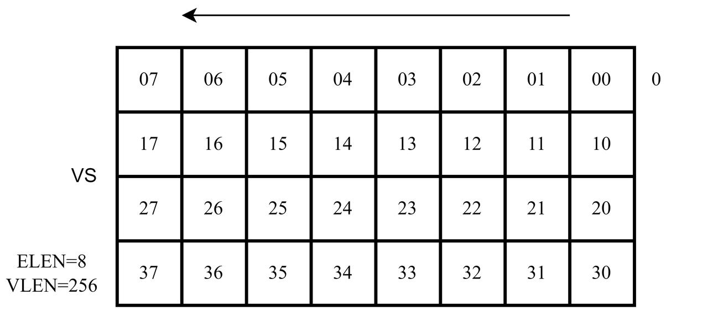
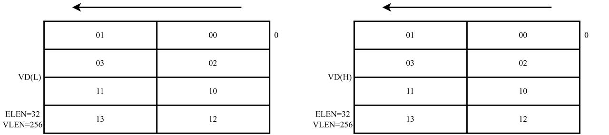
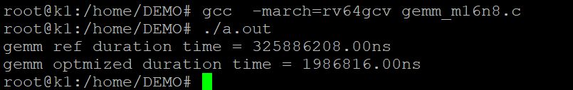

sidebar_position: 8

# 1. 背景介绍

在高性能领域，对于矩阵乘（GEMM）的优化是一个非常重要的课题。GEMM可以非常广泛地应用于航空航天、流体力学等科学计算领域，这也是之前HPC的主要应用场景。后来深度学习开展地如火如荼，由于对高算力的需要，也成为HPC的主要应用场景之一。这些年涌现了一系列的深度学习模型。模型里面最耗时的东西，包括卷积、全连接层、attention，都可以转换成GEMM操作。

# 2. 算法介绍

我们定义一个矩阵 为一个大小为m行n列的矩阵，那么两个矩阵的乘法可以定义为:
$$
\mathbf{C}_{m \times n}=\mathbf{A}_{m \times k} \times \mathbf{B}_{k \times n}
$$
以$m=4, n= 4, k = 8$举例，给定输入矩阵
$$
\mathbf{A}_{4\times 8} =
\begin{pmatrix}
a_{00} & a_{01} & \cdots & a_{07} \\
a_{10} & a_{11} & \cdots & a_{17} \\
a_{20} & a_{21} & \cdots & a_{27} \\
a_{30} & a_{31} & \cdots & a_{37} \\
\end{pmatrix}_{4\times 8}
$$

给定输入矩阵
$$
\mathbf{B}_{8\times4}=
\begin{pmatrix}
b_{00} & b_{01} & b_{02} & b_{03} \\
b_{10} & b_{11} & b_{12} & b_{13} \\
\vdots & \vdots & \vdots & \vdots \\
b_{70} & b_{71} & b_{72} & b_{73} \\
\end{pmatrix}_{8\times 4}
$$

其输出为
$$
\mathbf{C}_{4\times4}=
\begin{pmatrix}
c_{00} & \cdots & c_{03}\\
\vdots & \ddots &\vdots\\
c_{30} & \cdots & c_{33}\\
\end{pmatrix}_{4\times4}
$$

其具体实现的伪代码为：

```c
for (size_t i = 0; i < M; ++i) {
    for (size_t j = 0; j < N; ++j) {
        for (size_t kk = 0; kk < K; ++kk) {
            C[i * N + j] += A[i * K + kk] * B[kk * N + j];
        }
    }
}
```

# 3. 优化案例

## 3.1 矩阵元素在寄存器中的排布

以上述$m=4, n= 4, k =8$的矩阵乘法举例，在给定VLEN等于256bits、ELEN等于8bits的情况下，向量寄存器如下图所示，矩阵$\mathbf{A}$中元素在向量寄存器中存储的映射方式为：$$f:a_i\mapsto RS1_i, i\in\{00,\cdots37\}$$



在给定VLEN等于256bits、ELEN等于8bits的情况下，矩阵$\mathbf{B}$中的元素在向量寄存器中存储的映射方式为$$f\circ g$$其中g为矩阵转置映射，其表达式为：$$g:b_{ij}\mapsto b_{ji}, b_{ij}\in\mathbf{B}_{8\times 4}$$

在给定VLEN等于256bits、ELEN等于32bits的情况下，向量寄存器如下图所示，矩阵$\mathbf{C}$中元素在向量寄存器中的存储方式为：$$f:c_i\mapsto RD(J)_{i'}, i\in\{00,\cdots,33\},J=H if (i|0111_2)  else L, i'=i|0111_2$$



## 3.2 矩阵乘的实现

在给定输入矩阵$A_{4\times 8}$和输入矩阵$B_{8\times 4}$时
，输出矩阵$C_{4\times 4}$的计算如公式所示

$$
c_{ij}=\sum_{k=0}^{7}a_{ik}b_{kj}, i\in\{0,1,2,3\},j\in\{0,1,2,3\}
$$

按照矩阵$\mathbf{A}$的行乘矩阵$\mathbf{B}$的列的方式，上式可以表示为下式的形式。
$$
c_{ij}=a_{i\cdot}\cdot b_{\cdot j}, i\in\{1,2,3,4\},j\in\{1,2,3,4\}
$$

上式中
$a_{i\cdot}$
和
$b_{\cdot j}$
分别表示矩阵$A$和矩阵$B$的第$i$行行向量和第$j$列列向量，根据上节中矩阵在寄存器中的排布方式和映射，输出矩阵$C$中部分元素的计算如以下两图所示。

.jpg>)

.jpg>)

根据矩阵元素在寄存器中的映射，VD(L)和VD(H)中的数据计算如下式所示。

$$
\begin{cases}
VD(L)_{00}&= VS1_{00}\times VS2_{01}+VS1_{01}\times VS2_{01}
+\cdots+VS1_{07}\times VS2_{07}\\
&\quad\quad\quad\vdots\\
VD(L)_{03}&= VS1_{00}\times VS2_{30}+VS1_{01}\times VS2_{31}
+\cdots+VS1_{07}\times VS2_{37}\\
VD(L)_{04}&= VS1_{10}\times VS2_{00} +VS1_{11}\times VS2_{01}+\cdots+VS1_{17}\times VS2_{07}\\
&\quad\quad\quad\vdots\\
VD(L)_{07}&= VS1_{10}\times VS2_{30}+VS1_{11}\times VS2_{31}+\cdots+VS1_{17}\times VS2_{37}\\
VD(H)_{00}&= VS1_{20}\times VS2_{00}+VS1_{21}\times VS2_{01}+\cdots+VS1_{27}\times VS2_{07}\\
&\quad\quad\quad\vdots\\
VD(H)_{03}&= VS1_{20}\times VS2_{30}+VS1_{21}\times VS2_{31}+\cdots+VS1_{27}\times VS2_{37}\\
VD(H)_{04}&= VS1_{30}\times VS2_{00}+VS1_{31}\times VS2_{01}+\cdots+VS1_{37}\times VS2_{07}\\
&\quad\quad\quad\vdots\\
VD(H)_{07}&= VS1_{30}\times VS2_{30}+VS1_{31}\times VS2_{31}+\cdots+VS1_{37}\times VS2_{37}
\end{cases}
$$

## 3.3 代码

对于一个最简单的$m = 4, n = 4, k = 8$的矩阵乘法，其核心代码如下：

```c
void matmul(const int8_t *A, const int8_t *B, int32_t *C) {
    __asm__ volatile(
        "vsetvli        t0, zero, e8, m1          \n\t"
        "vle8.v         v0, (%[A])                \n\t"
        "vle8.v         v1, (%[A])                \n\t"
        "vmadot         v16, v0, v1               \n\t"
        "vsetvli        t0, zero, e32, m2         \n\t"
        "vse32.v        v16, (%[C])               \n\t"
        : [ A ] "+r"(A), [ B ] "+r"(B), [ C ] "+r"(C)
        :
        : "cc");
}
```

## 3.4 测试代码

```c
// 交叉编译指令
riscv64-unknown-linux-gnu-gcc -march=rv64gcv_zfh gemm_m16n8.c
// 本地编译指令
gcc -march=rv64gcv_zfh gemm_m16n8.c
// 运行指令
./a.out
```

[gemm\_m16n8.zip](code/gemm_m16n8.zip)



