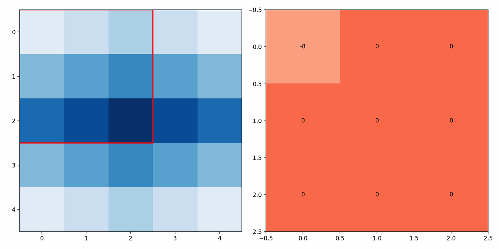
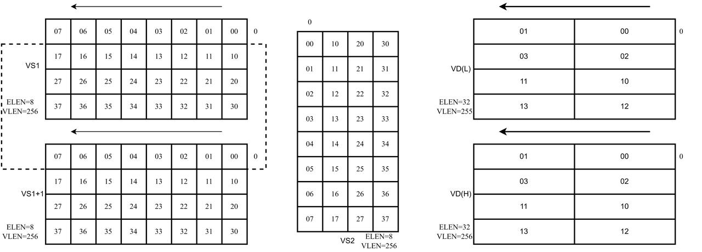
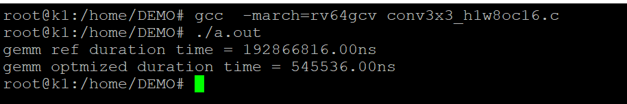

sidebar_position: 9

# 1. 背景介绍

卷积神经网络是一种深度学习模型，常用于解决图像识别问题。相较于全连接神经网络，卷积神经网络采用局部感知性和参数共享的方式，通过卷积核的滑动和权值共享，可以有效减少参数数量和计算量，提高模型的泛化能力。其广泛应用于图像分类、目标检测、图像分割等领域。卷积神经网络在图像处理领域的应用不仅提高了图像处理的效率和准确性，也推动了人工智能技术在视觉领域的发展和应用。

# 2. 卷积介绍

以conv3x3，stride=1，dilation = 1, padding = 0举例，给定输入形状$[H,W] = [5, 5]$，输出形状为$[H,W]=[3,3]$，其计算流程如下所示：




# 3. 优化案例

## 3.1 滑动窗口指令实现

根据矩阵乘在RVV指令基础上的实现，综合利用数据的空间局部性，设计得到矩阵乘的滑动窗口指令。对于滑动窗口指令，要求VS1为偶数编号（$0,2,\cdots,30$）的向量寄存器，潜在的使用编号VS1和编号VS1+1的向量寄存器；VS2为32个向量寄存器中的一个；VD为偶数编号（$0,2,\cdots,30$）的向量寄存器，潜在使用编号VD向量寄存器作为VD(L)、使用编号VD+1向量寄存器作为VD(H)。

综上可以将一个$8\times 8$大小的矩阵拆分为两个输入矩阵$\mathbf{A}^1_{4\times8}$和$\mathbf{A}^2_{4\times8}$，其中$\mathbf{A}^1_{4\times8}$存在VS1号向量寄存器中，$\mathbf{A}^2_{4\times8}$按照存放在vs+1号向量寄存器中，此时矩阵乘指令如下图所示。

.jpg>)

当偏移量为1时，窗口滑动8bytes，使用矩阵$\mathbf{A}^1$的第2、3、4行和矩阵$\mathbf{A}^2$的第1行作为输入矩阵$\mathbf{A}$，其如下图所示。



当偏移量为2时，窗口滑动16bytes，使用矩阵$\mathbf{A}^1$的第3、4行和矩阵$\mathbf{A}^2$的第1、2行作为输入矩阵$\mathbf{A}$，其如下图所示。

.jpg>)

当偏移量为3时，窗口滑动24bytes，使用矩阵$\mathbf{A}^1$的第4行和矩阵$\mathbf{A}^2$的第1、2、3行作为输入矩阵$\mathbf{A}$，其如下图所示。

.jpg>)

## 3.2 2D卷积滑窗实现示例

使用以上矩阵乘和滑动窗口指令，用以下示例来展示滑动窗口2d卷积的计算。给定输入特征图尺寸为$HWC=3\times8\times8$，$3\times3$卷积，$stride=1$,$padding=0$，输出通道数$O_c=4$，此时输出的特征图尺寸为$HWC=1\times6\times4$。

使用如下三条指令，实现以下三图的效果。每次会将当前VD向量寄存器中存储的值累加上此次矩阵乘得到的值。

```c
vmadot     vd, vs1, vs2
vmadot1    vd, vs1, vs2
vmadot2    vd, vs1, vs2
```

-R1C1 (3).jpg>)

-R1C2 (3).jpg>)

-R1C3 (2).jpg>)

如此实现了特征图感受野内第一行和卷积的第一行的计算，第二行和第三行的计算按照上述累加的方式进行，分别如以下两图所示。

-R2 (2).jpg>)

-R3 (1).jpg>)

执行完以上操作，目标向量寄存器中存储的值与输出特征图的映射关系如下图所示。

-output (4).jpg>)

对输入特征图进行滑动，由于行方向不足8，进行padding补0，此时，下图中VS1寄存器中的值只需要从上一轮中VS1+1寄存器中搬运，VS1+1寄存器的值全置为0即可，按照下图的表示方式，即可计算完输出特征图，完成2D卷积操作。

-第 25 页 (2).jpg>)

## 3.3 计算核心代码

以下是一个1x3卷积的计算核心代码:

```c
void conv1x3(const int8_t *feature, const int8_t *weight, int32_t *output) {
    __asm__ volatile(
        "vsetvli    t0, zero, e8, m1        \n\t"
        "vle8.v     v0, (%[A])              \n\t"
        "addi       %[A], %[A], 4*8         \n\t"
        "vle8.v     v1, (%[A])              \n\t"
        "addi       %[A], %[A], 4*8         \n\t"
        "vle8.v     v3, (%[A])              \n\t"
        "addi       %[A], %[A], 4*8         \n\t"
        "vmv.v.v    v2, v1                  \n\t"
        "vle8.v     v8, (%[B])              \n\t"
        "addi       %[B], %[B], 4*8         \n\t"
        "vle8.v     v9, (%[B])              \n\t"
        "addi       %[B], %[B], 4*8         \n\t"
        "vle8.v     v10, (%[B])             \n\t"
        "addi       %[B], %[B], 4*8         \n\t"
        "vmadot     v16, v0, v8             \n\t"
        "vmadot1    v16, v0, v9             \n\t"
        "vmadot2    v16, v0, v10            \n\t"
        : [A] "+r"(feature), [ B ] "+r"(weight), [ C ] "+r"(output)
        :
        : "cc");
}
```

## 3.4 测试代码

```c
// 交叉编译指令
riscv64-unknown-linux-gnu-gcc -march=rv64gcv_zfh conv3x3_h1w8oc16.c
// 本地编译指令
gcc -march=rv64gcv_zfh conv3x3_h1w8oc16.c
// 运行指令
./a.out
```

[conv3x3\_h1w8oc16.zip](code/conv3x3_h1w8oc16.zip)



